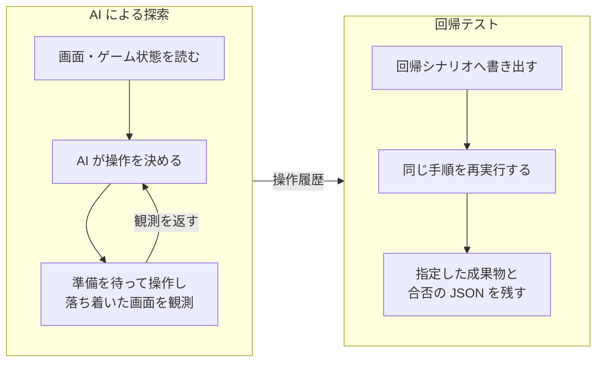

# UniTestify

Unity のゲームを、テストコードや AI エージェントから「見て、触る」ためのツール群。

## なぜ作ったか

ゲーム画面を AI に確かめさせようとすると、素朴にはスクリーンショットを撮って渡すことになる。
しかし画像は読み取りの費用が高いうえに、「このボタンは今押せるのか」「何かに隠れていないか」
「画面外にはみ出していないか」を、画像から確実に読み取ることはできない。

UniTestify は画面を 1 枚のテキストに変換する。何があって、どれにフォーカスがあって、
何が無効で、何に遮られているかが、そのまま文字で返ってくる。

```
scene=Home focus=DollRow/DollButton0(アリア)
[Text] AssetsBar/GoldValue 「120G」
[Button] WorkshopTabBarView/TabButton0 「編成」 !disabled
[Button] DollRow/DollButton0 「[F] アリア 戦士 Lv2」 *focused
[Button] Content/MarketRuneListRow6 「明 呪詛のルーン」 blocked:Panel [clipped]
game: gold=120 run.floor=2 battle.active=false
agent: busy=inputBlocked
```

`!disabled` は押せない状態、`*focused` は今フォーカスがある要素、
`blocked:Panel` は `Panel` に覆われていること、`[clipped]` はスクロール領域の外にあることを表す。
`game:` はゲーム側が登録した値で、画面に出ていない所持金や進行度も一緒に観測できる。
`agent:` は入力が受け付けられる状態かどうかを示す。

**この 1 枚があれば、押す前に押せるかどうかが分かる。** 押してから画面を撮って
目で確かめる、という往復が要らなくなる。

## 何ができるか

**押せるようになるまで待ってから押す。** 要素が現れ、有効になり、何にも遮られていない状態を
確認してから操作する。操作したあとは画面が落ち着くまで待ち、その時点の観測を返す。
遷移の完了を待ちたいときは、待つ対象（文字・オブジェクト・フォーカス・シーン）を一緒に渡せる。
呼ぶ側でポーリングを書く必要はない。

**期待どおりかを機械が判定する。** 「このボタンが有効になっているはず」「この文字が出ているはず」を
操作と同時に渡せる。満たされなければ、どの条件が外れたかが返る。

**手順を記録して回帰テストにできる。** AI が探索した操作列をそのまま JSON のシナリオへ書き出し、
繰り返し実行できる。実行結果は撮影・監査・録画・合否の JSON として残る。



観測をもとに探索を繰り返し、その操作履歴を回帰シナリオと検証の成果物へつなげる流れを示します。

このほか、Game View と Device Simulator の PNG 撮影（白紙かどうかの判定つき）、
レイアウト監査（はみ出しと重なりの検出）、シーン階層のダンプ、コンソールログの取得、
例外が出たときのスクリーンショットと UI 状態の自動保存、
実時間どおりの連番 JPG と音声 WAV による録画がある。

**実機でも同じ操作ができる。** Android / iOS / PC Standalone の Development Build に対して、
シナリオを自律実行させるか、HTTP で 1 手ずつ対話的に操作するかを選べる。

## 動作環境

- Unity 6000.x
- 必須パッケージ: Input System、TextMeshPro
- **ゲーム本体で使う類のライブラリ（R3 / UniTask / DI コンテナ等）に依存しない。** 依存は UnityEngine と .NET 標準、上記 2 パッケージだけである
- 入口は 3 つ。ファイル I/O のメールボックス（ネットワーク不要）、HTTP（実機向け）、Unity 公式 CLI（`com.unity.pipeline` を入れた場合の任意）
- 実機は Android / iOS / PC Standalone の Development Build

## 導入

- `Packages/manifest.json` に `"com.pisuke.unitestify": "https://github.com/MasaKoha/UniTestify.git"` を追加する
- コピーで入れる場合はリポジトリ直下の `Runtime/ Editor/ Pipeline/ Tests/ Tools/ package.json` を `Assets/` 配下へ置く
- Play に入る前にプロジェクト直下へ `DebugOutput/agent-mailbox/.enabled` を置く。Python クライアントが自動で作る
- 成果物はすべて `DebugOutput/` 配下に出る。バージョン管理から除外する

## 最小の使い方

`Tools/ai_client.py` を使う。

```sh
python3 Tools/ai_client.py ping
python3 Tools/ai_client.py agent.act '{"action":{"submit":"StartButton"},"waitForObject":"HomeView"}'
python3 Tools/ai_client.py agent.find '{"label":"開始","kind":"Button"}'
python3 Tools/ai_client.py agent.observe '{"capture":"home"}'
```

`agent.act` は対象が押せるまで待ち、`waitForObject` で遷移の完了も待つ。呼ぶ側にポーリングは要らない。

## AI エージェントから使う

やり取りはファイルの読み書きだけで完結する。ネットワークを使わないため、
外部への通信が制限されたサンドボックスからでも動く。

入口は 3 つある。ファイル I/O のメールボックス、実機向けの HTTP、
そして Unity 公式 CLI（`com.unity.pipeline` を入れた場合に `unity command ai_*` から呼べる）。
Claude Code と Codex それぞれの設定は [docs/getting-started.md](docs/getting-started.md) にある。

探索したセッションはそのまま回帰シナリオへ書き出せるので、
AI に遊ばせて見つけた不具合を、そのままテストとして残せる。

## 性能

計測環境: Apple M2 Pro / macOS / Unity 6000.x / Editor の Play モード

| 項目 | 実測 |
|---|---|
| 1 往復（同一プロセスから連続）| 中央値 52 ms（最小 15 ms） |
| 1 往復（コマンド 1 回ごとに起動）| 中央値 117 ms |
| 撮影を含む 1 往復（コマンド起動込み）| 中央値 165 ms |
| 撮影の出力 | 1280x720 の PNG で約 32 KB |

- 往復時間は op の種類でほとんど変わらない。**要求ファイルを監視する間隔（既定 50 ms）が支配的**なためである
- 要求が続かない間は監視間隔が 250 ms へ落ちる。待機中の負荷を下げるためである
- コマンドを 1 回ずつ起動する経路では、Python の起動時間が上乗せされる

## 気をつけること

**3D オブジェクトは操作できない。** 存在の確認だけできる（シーン階層のダンプ）。
操作の対象は uGUI の要素である。

**要求は 1 件ずつ処理する。** 複数の入口から同じセッションへ同時に送ることは想定していない。

**LAN 経由の HTTP 接続では、環境によって IPv6 のサブネット判定ができない。**
その場合は IPv4 で接続する。

**実機でゲーム側の状態を観測に載せるには、アダプタの実装を利用側のプロジェクトに置く必要がある。**
エディタではコンパイル済みアセンブリの注入で回避できる。

**録画で音声を録るときは、シーンに `AudioListener` が要る。**
無いと、正しい長さの無音 WAV ができてしまい、失敗に気づけない。

## ドキュメント

| ページ | 内容 |
|---|---|
| [docs/getting-started.md](docs/getting-started.md) | 導入、メールボックスと CLI の起動、ゲーム側の状態提供の登録、実機での実行 |
| [docs/ops-reference.md](docs/ops-reference.md) | 全 op の引数・応答・観測テキストの読み方 |
| [docs/scenario-guide.md](docs/scenario-guide.md) | 回帰シナリオ JSON の語彙と、探索セッションからの書き出し |
| [docs/recording-and-artifacts.md](docs/recording-and-artifacts.md) | 録画と `DebugOutput/` の成果物 |
| [docs/architecture.md](docs/architecture.md) | モジュール構成と依存の方針 |

## 開発環境

- `TestProject/` を Unity で開き、Test Runner の EditMode を実行する。このパッケージを `file:../../` で参照している
- Python 側のツールは `python3 -m unittest discover -s Tools -p "test_*.py"` で実行する

## ライセンス

MIT License
