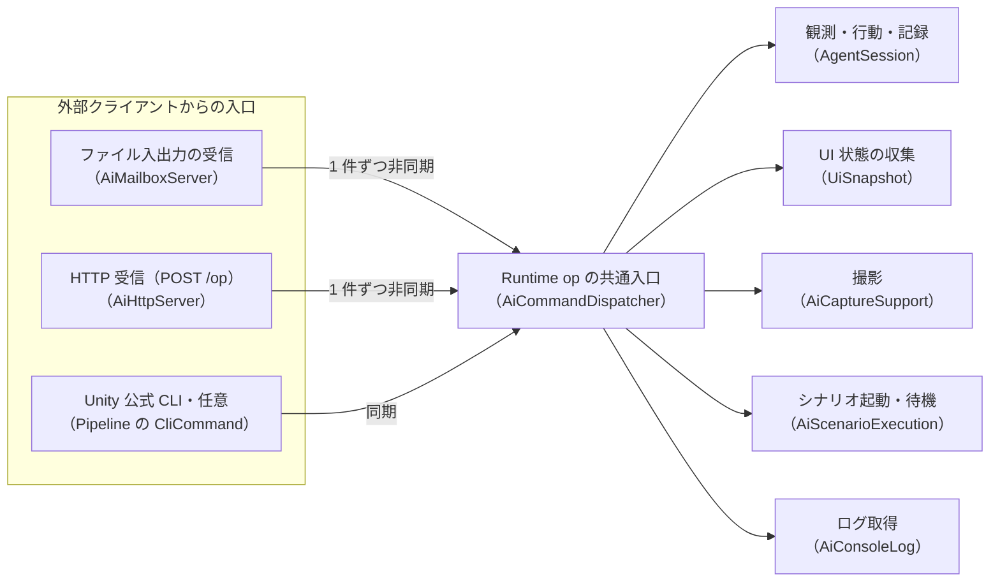
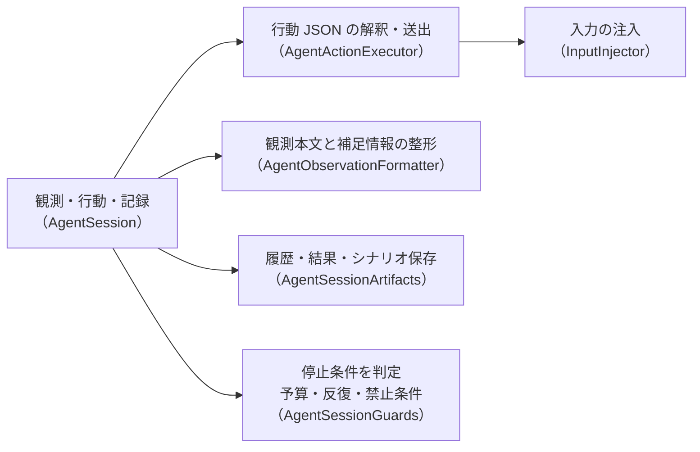

# アーキテクチャ

本書は、内部構造の変更や拡張を行う開発者、ならびに設計思想や依存制約の根拠を把握したい読者を対象とする。
単なる利用手順の確認のみを求める場合は、読む必要はない。
各機能群の役割分担や依存の原則、処理速度を重視した設計、および検証の方針について解説する。

## 全体像



Runtime op の三つの入口が共通ディスパッチャへ合流し、各機能へ処理を振り分ける構成を示します。



セッションが行動の送出、観測の整形、成果物の保存、停止条件の判定を各担当へ委ねる関係を示します。

ゲーム側との接点は `GameAdapterRegistry` だけ:

| 登録先 | ゲームが実装するもの | 使われ方 |
|---|---|---|
| `StateProvider` | `IGameStateProvider.GetState()` | 観測の `game:` 行 |
| `BusyProvider` | `IGameBusyProvider.IsBusy / Reason` | 落ち着き待ちと `agent: busy=` |
| `CommandHandler` | `IGameCommandHandler` | デバッグコマンド（素材付与等） |

Editor の任意注入は `adapters.load`（または `agent.begin` の `options.adaptersDirectory`）→
`GameAdapterLoader.Loader` → `Pipeline/Adapters/AiAdapterInjector` → `GameAdapterTypeBinder.Bind(Type[])` →
`GameAdapterRegistry` の経路。`[InitializeOnLoadMethod]` で Loader を登録し、Runtime から Pipeline への型依存は持たない。
`InternalsVisibleTo("UniTestify.Pipeline")` で internal の登録口・結果型・Binder を共有する。
Injector は `#if TESTIFY_PIPELINE && UNITY_EDITOR`、Loader 未登録は専用の失敗 message で返す。
ソース確認した Pipeline `0.6.0-exp.1` の internal コンパイラを反射で呼び、
`HotReloadCompileResult.AssemblyName` からロード済みアセンブリを取得する。
型名・メソッド名・参照する結果プロパティ名は Injector 内の定数に集約する。
純ロジックの Binder が公開の引数なしコンストラクタと三つの契約で選別し、完全型名の重複をスキップする。
Runtime 直下は Loader / Binder の二つを加えて 4→6、結果型は一ファイル一主要型の規約に従い `Results/` に置く。

Editor の撮影対象選択は `Editor/Gateway/PlayModeViewFocus` が
`AiPlayModeViewFocus.FocusHandler` に登録する。Runtime は Editor の型を参照せず、
`InternalsVisibleTo("UniTestify.Editor")` で internal の登録口を Editor 側から使えるようにする。
メールボックスの要求処理は既存の `AiCommandDispatcher.ExecuteAsync` 内でフォーカス → 解像度安定待ち
（2 フレーム連続一致、上限 5 フレーム）→ 観測・撮影の順に進む。観測と撮影の間では yield しない。
同期 CLI は view の適用成功時にフォーカスだけを行い、次回の view 未指定呼び出しで撮影・観測する。

実機への対話操作は `Tools/ai_client.py --transport http --url http://HOST:PORT` →
`Runtime/Gateway/Http/AiHttpListener` → `AiHttpServer` → 同じ `AiCommandDispatcher.ExecuteAsync` の経路。
`AfterSceneLoad` で T5 の `UniTestifySettings.asset` を読み、`DebugOutputPath.DirectoryPath/http.enabled`
の指定キーで上書きする。既定は無効・ポート 7910・LAN 不許可。実ポートとトークンは `http.port.json` に公開する。
`HttpListener` は `http://+:<port>/` を待ち受け、接続元と Bearer トークンを確認する。
`GetContextAsync` と本文の読取・応答の書込はワーカーで行い、`AiHttpExchange` を要求キューへ積む。
`AiHttpServer.Update` は一件ずつ取り出してコルーチンを開始する。ワーカーは応答までコンテキストを保持する。
待機フレームで JSON 変換・ネットワーク列挙・LINQ・新規確保は行わない。
停止時はコルーチンの `Dispose` と待受の `Close` で待機を解き、接続情報を削除する。
要求・応答は既存の `AiCommandRequest` / `AiCommandResponse`。HTTP 独自の op や Pipeline の追加はない。

Editor 操作は `Tools/editor_ctl.py` → `DebugOutput/editor-mailbox/` →
`EditorControlMailbox` → `EditorApplication` の独立した経路。
`[InitializeOnLoad]` で常駐し、Play 停止中も `EditorApplication.update` で処理する。
`EditorControlRequest` が JSON 解釈と検証、`EditorControlResponse` が `ok/message` の応答生成を担当し、
Editor API 呼び出しはメールボックス側に限定する。フォーカスは T1 の `PlayModeViewFocus.TryFocus` を直接共用する。
要求の公開通知を `FileSystemWatcher` で受け、定数 0.05 秒のポーリングで必要な走査だけを行う。
監視とイベント購読はドメインリロード前・Editor 終了時に解放する。

対話操作の `waitFor*` は `AgentActionWait` がシナリオの `CreateAnchor` / `IsAnchorSatisfied` を共用して待つ。
メールボックスではアンカー待ち → 対象の準備待ち → 行動の順に実行し、タイムアウト時は行動を送らない。
同期 CLI の未成立アンカーは拒否する。待機上限の既定値は `UiScenarioStep.DefaultTimeoutSeconds`（30 秒）に集約し、
履歴・export に待ち条件と指定上限を保持する。
`scene.dump` は `SceneHierarchyDumper` の収集結果を `SceneHierarchyDumpText` で制限・整形する。
保存時は同じ収集結果の全階層 JSON を `DebugOutput/scene/` へ書き出す。

実機の自律実行は `ScenarioAutorun` → `UiScenarioRunner.Run` の独立した経路。
`AfterSceneLoad` で `Resources/UniTestifySettings.asset` を読み、`scenario-autorun.json` の指定項目、
Standalone / Editor の `-unitestify-scenario` のパスの順に上書きする。
実時間の待機後に一度だけ実行し、結果の絶対 `path` と `verdict` を `scenario-autorun.done.json` に保存する。
メールボックス・`.enabled` に依存せず、空の既定パスでは起動しない。
`DebugOutputPath` は Editor でプロジェクトルート、実機で `persistentDataPath` の下に `DebugOutput` を置く。
撮影 `directory` と `scenario.run`／自律実行の `path` の相対解決も同じ環境別ルートを使う。

## フォルダ構成

各行のファイル数は直下の `.cs` のみ（子フォルダ・`.meta`・`.asmdef` は含めない）。
機能を境界とし、すべて上限 10 以下。入口の型を機能フォルダ直下、実装詳細を下位へ置く。
名前空間はフォルダ階層に連動させず、`UniTestify` / `UniTestify.Editor` / `UniTestify.Pipeline` / `UniTestify.Tests` のまま。

| アセンブリルート | 直下の C# | 据え置く定義 |
|---|---:|---|
| `Runtime/` | 0 | `Runtime/UniTestify.asmdef` |
| `Editor/` | 0 | `Editor/UniTestify.Editor.asmdef` |
| `Pipeline/` | 0 | `Pipeline/UniTestify.Pipeline.asmdef` |
| `Tests/EditMode/` | 0 | `Tests/EditMode/UniTestify.Tests.EditMode.asmdef` |

| フォルダ | C# 数 | 配置する責務 |
|---|---:|---|
| `Runtime/Agent/` | 7 | セッションの入口・寿命、設定、応答、要素検索、観測テキスト |
| `Runtime/Agent/Actions/` | 4 | 行動 JSON、アンカー待ち、入力送出、行動の事後条件 |
| `Runtime/Agent/Goals/` | 3 | 目標 JSON、目標の妥当性検証・達成判定 |
| `Runtime/Agent/Session/` | 4 | セッションの停止判定、履歴・成果物・終了レポート |
| `Runtime/Gateway/` | 8 | 共通ディスパッチャ、要求・応答・引数、JSON 検証、直近ログ、実行状態 |
| `Runtime/Gateway/Execution/` | 4 | 撮影の発行・完了待ち、撮影対象フォーカス・解像度安定待ち、シナリオ起動・結果待ち、入力後の静止待ち |
| `Runtime/Gateway/Mailbox/` | 3 | ファイル要求・応答、ポーリングサーバー、Prefab の型付き参照 |
| `Runtime/Gateway/Http/` | 5 | HTTP 起動ドライバ、ワーカーの待受・キュー、要求と応答待ちの対応、本文・認証・接続元の純ロジック、設定上書き |
| `Runtime/Scenario/` | 9 | シナリオの入口・ステップ解釈、入力実行、成果物保存、記録の開始停止、起動時の自律実行 |
| `Runtime/Scenario/Expectations/` | 3 | シナリオ期待値、評価器、失敗理由 |
| `Runtime/Scenario/Results/` | 3 | シナリオ全体・ステップの結果、証拠パス |
| `Runtime/Snapshot/` | 6 | UI スナップショットの収集・保存・整形・比較と観測モデル |
| `Runtime/Snapshot/Collection/` | 4 | シーン・要素・ゲーム状態の収集と観測モデルへの変換。TMP / legacy Text の文言を共通要素化 |
| `Runtime/Snapshot/Comparison/` | 1 | UI スナップショットの差分判定 |
| `Runtime/Snapshot/Output/` | 2 | 観測テキストの整形・JSON 保存 |
| `Runtime/Input/` | 9 | 入力注入・記録・再生、イベント・待機アンカー・再生結果、入力の語彙 |
| `Runtime/Input/Overlay/` | 8 | 入力可視化の入口・制御・描画・履歴・表示設定 |
| `Runtime/Input/Overlay/Input/` | 4 | 入力 API ごとの取得と押下・解放・保持状態 |
| `Runtime/Monkey/` | 8 | ランダム探索、設定、網羅率、操作履歴、違反・終了結果 |
| `Runtime/Performance/` | 5 | 性能計測の入口・フレーム採取、ステップ・全体レポート |
| `Runtime/Recording/` | 5 | 動画・音声記録、manifest、マーカー、録画結果 |
| `Runtime/Recording/Capture/` | 2 | 撮影範囲と GPU readback バッファの所有 |
| `Runtime/Recording/Encoding/` | 1 | フレームのエンコード・書込と一時バッファの解放 |
| `Runtime/Recording/Output/` | 2 | 録画成果物・manifest・ffmpeg コマンド |
| `Runtime/Recording/Session/` | 1 | 録画中の環境設定と復元 |
| `Runtime/Forensics/` | 6 | 例外時の証拠収集、文脈・保留ログ、ファイルログ出力 |
| `Runtime/Scene/` | 5 | シーン階層の収集・保存、コンパクトテキスト、シーン・ノード・ダンプモデル |
| `Runtime/Ui/` | 9 | UI 入力対象の解決、TMP / legacy Text の可視判定・ラベル抽出、観測範囲・準備状態、スクロール、レイアウト監査 |
| `Runtime/Adapters/` | 6 | ゲーム状態・busy・コマンドの接続契約と登録窓口、任意 Loader、実装型の選別・登録 |
| `Runtime/Adapters/Results/` | 1 | Pipeline に依存しないアダプタ注入結果 |
| `Runtime/Core/` | 4 | 環境別の出力先、UniTestifySettings、アセンブリ属性、SerializeField 結線情報 |
| `Runtime/Resources/` | 0 | `AiMailboxPrefab.asset` の型付き参照とビルド設定の `UniTestifySettings.asset` |
| `Runtime/RunArchive/` | 3 | ラン概要と性能・視覚回帰の要約モデル |
| `Editor/Gateway/` | 3 | Game View / Device Simulator のフォーカス処理、Editor 操作の要求・応答 |
| `Editor/Gateway/Mailbox/` | 2 | Runtime メールボックス起動メニュー、Editor 操作メールボックス |
| `Editor/RunArchive/` | 8 | 成果物の集約・索引生成、シナリオ成果物の読取モデル、メニュー |
| `Editor/RunArchive/Export/` | 4 | 成果物の選択・コピー・配送 |
| `Editor/RunArchive/References/` | 2 | コピー先の参照パスとシナリオ結果の書換え |
| `Editor/RunArchive/Summary/` | 2 | ラン概要と対象期間の構築 |
| `Editor/RunArchive/Index/` | 1 | 保存済みランの索引再構築 |
| `Editor/VisualRegression/` | 9 | 画像比較、無視領域の解析・設定、比較結果・レポート、メニュー |
| `Editor/Scenario/` | 1 | シナリオ実行メニュー |
| `Editor/Scene/` | 1 | シーン階層ダンプメニュー |
| `Editor/Snapshot/` | 1 | スナップショット保存・入力オーバーレイ確認メニュー |
| `Editor/Ui/` | 1 | UI レイアウト監査メニュー |
| `Pipeline/Agent/` | 6 | エージェントの開始・行動・観測・目標判定・終了・書出し CLI |
| `Pipeline/Adapters/` | 1 | Editor 限定の外部アダプタコンパイルと Loader 登録 |
| `Pipeline/Gateway/` | 3 | CLI 引数・実行支援、op 一覧 CLI |
| `Pipeline/Gateway/Execution/` | 1 | 撮影 CLI |
| `Pipeline/Gateway/Mailbox/` | 1 | メールボックス CLI |
| `Pipeline/Scenario/` | 3 | シナリオ実行・状態取得 CLI と状態応答 |
| `Pipeline/Scene/` | 1 | シーン階層ダンプ CLI |
| `Pipeline/Snapshot/` | 1 | UI スナップショット CLI |
| `Pipeline/Forensics/` | 2 | 最新フォレンジック CLI と応答 |
| `Pipeline/Monkey/` | 1 | ランダム探索 CLI |
| `Tests/EditMode/Runtime/` | 0 | 実装のアセンブリ・機能階層に対応する親フォルダ（直下の C# なし） |
| `Tests/EditMode/Runtime/Input/` | 0 | 実装のアセンブリ・機能階層に対応する親フォルダ（直下の C# なし） |
| `Tests/EditMode/Runtime/Input/Overlay/` | 0 | 実装のアセンブリ・機能階層に対応する親フォルダ（直下の C# なし） |
| `Tests/EditMode/Runtime/Agent/` | 2 | `Runtime/Agent/` に対応する EditMode テスト |
| `Tests/EditMode/Runtime/Adapters/` | 1 | 三種のアダプタ登録、複数契約、重複・非該当型の選別と例外伝播 |
| `Tests/EditMode/Runtime/Agent/Actions/` | 3 | `Runtime/Agent/Actions/` に対応する EditMode テスト |
| `Tests/EditMode/Runtime/Agent/Goals/` | 1 | `Runtime/Agent/Goals/` に対応する EditMode テスト |
| `Tests/EditMode/Runtime/Agent/Session/` | 2 | `Runtime/Agent/Session/` に対応する EditMode テスト |
| `Tests/EditMode/Runtime/Core/` | 1 | Editor / 実機の出力先と相対・絶対パス解決 |
| `Tests/EditMode/Runtime/Gateway/` | 3 | `Runtime/Gateway/` に対応する EditMode テスト |
| `Tests/EditMode/Runtime/Gateway/Execution/` | 3 | `Runtime/Gateway/Execution/` に対応する EditMode テスト |
| `Tests/EditMode/Runtime/Gateway/Mailbox/` | 2 | `Runtime/Gateway/Mailbox/` に対応する EditMode テスト |
| `Tests/EditMode/Runtime/Gateway/Http/` | 1 | 本文の復元、Bearer 認証、ループバック・サブネット・設定上書きの純ロジック |
| `Tests/EditMode/Runtime/Scenario/` | 1 | 自律実行の設定 JSON・既定値・上書き順の純ロジックテスト |
| `Tests/EditMode/Runtime/Scenario/Expectations/` | 1 | 非 UI オブジェクトの存在・不在の一回評価 |
| `Tests/EditMode/Runtime/Scene/` | 1 | 階層テキストの深さ・件数制限とアクティブ状態 |
| `Tests/EditMode/Runtime/Snapshot/` | 4 | `Runtime/Snapshot/` に対応する EditMode テスト。legacy Text の収集・文字判定を含む |
| `Tests/EditMode/Runtime/Recording/` | 0 | 録画実装に対応するテストの親フォルダ |
| `Tests/EditMode/Runtime/Recording/Capture/` | 1 | `Runtime/Recording/Capture/` に対応する EditMode テスト |
| `Tests/EditMode/Runtime/Recording/Output/` | 2 | `Runtime/Recording/Output/` に対応する EditMode テスト |
| `Tests/EditMode/Runtime/Input/Overlay/Input/` | 1 | `Runtime/Input/Overlay/Input/` に対応する EditMode テスト |
| `Tests/EditMode/Runtime/Ui/` | 3 | `Runtime/Ui/` に対応する EditMode テスト |
| `Tests/EditMode/Editor/` | 0 | Editor 実装に対応するテストの親フォルダ |
| `Tests/EditMode/Editor/Gateway/` | 0 | Editor ゲートウェイに対応するテストの親フォルダ |
| `Tests/EditMode/Editor/Gateway/Mailbox/` | 1 | Editor 操作の要求 JSON・検証・応答契約の EditMode テスト |

| ツールフォルダ | Python 数 | 配置する責務 |
|---|---:|---|
| `Tools/` | 3 | `ai_client.py`（file / http の Runtime 操作）、`editor_ctl.py`（Editor 操作）、`test_ai_client.py` |

`Runtime/Prefabs/`（メールボックスの Prefab）と `Runtime/Resources/`（型付き参照・ビルド設定アセット）は既存位置を維持する。
既存スクリプトの `.meta` はスクリプトと対で移し、追加フォルダにも `.meta` を置く。

テストは `Tests/EditMode/<実装アセンブリのルート>/<同じ機能パス>/` へ対応させる。
現存する 34 ファイルのうち 33 ファイルは Runtime、1 ファイルは Editor 対象。
Editor 操作の要求・応答テストは仕様指定の `Editor/Gateway/Mailbox/` に配置する。
Tests asmdef は `UniTestify` と `UniTestify.Editor`、UI コンポーネントの検証用に `UnityEngine.UI` と `Unity.TextMeshPro` を参照する。
Runtime asmdef も uGUI の型を直接利用するため `UnityEngine.UI` を明示参照する。
Pipeline のテストを追加する場合も同じ対応規則に従い、テストのない機能に空フォルダは作らない。
複数機能を検証する既存テストは主対象で配置する（`AgentExportTest` は `Agent/Session/`）。

## 依存の鉄則

1. ゲーム本体で使う類のライブラリに依存しない（Rx 実装・非同期ライブラリ・DI コンテナなど）。依存は `UnityEngine`・.NET 標準・`Unity.TextMeshPro`・`Unity.InputSystem`
2. `Pipeline/` は `com.unity.pipeline` が無くてもコンパイルできる（asmdef の `versionDefines` で `TESTIFY_PIPELINE`）
3. 毎フレーム処理（`AiMailboxServer.Update`、オーバーレイ描画）はアロケーションを増やさない。観測時（`UiSnapshot.Capture`）だけ `GetComponent` 可
4. 名前空間は `UniTestify`。`Debug` という語を名前空間に使わない

## 速さのための設計

- **Unity 内蔵メールボックス**: 外部中継プロセスと CLI 起動（node）を経由しない。1 往復 0.10 秒
- **準備待ちと落ち着き待ちを Unity 側で完結**: `submit` は対象が押せるまで、その後は継続入力・シーンロード・ゲームの busy が収まって 0.35 秒静止するまで待ってから観測する。AI は空押しの待ち手を入れなくてよい
- **観測のダイエット**: 画面外・マスク外・背面の要素を既定で出さない。同名行は先頭 3 件＋件数に畳む。同一フレームのスナップショットは共有
- **往復の削減**: `steps` 一括、`expect` 同時検証、`agent.find`、`scrollTo`、観測と撮影の同一フレーム
- **省電力**: 要求が 5 秒無ければポーリングを 0.05 → 0.25 秒に伸ばす

## 利用側への同期

パッケージ参照（git URL）が基本。ソースをコピーして使う場合は、リポジトリ直下の
`Runtime/ Editor/ Pipeline/ Tests/ Tools/ package.json` を利用側の `Assets/UniTestify/` へ置く。

```sh
rsync -a --delete \
  --exclude TestProject --exclude docs --exclude .git --exclude .gitignore \
  --exclude CLAUDE.md --exclude AGENTS.md --exclude README.md --exclude LICENSE \
  <このリポジトリ>/ <利用側>/Assets/UniTestify/
```

変更はこのリポジトリ側で行う。利用側の `Assets/UniTestify/` を直接編集すると次の同期で消える。

## テスト

- `Tests/EditMode/` は純ロジックのみ（PlayMode 不要）。`TestProject/` を Unity で開いて Test Runner で回す
- PlayMode が要る確認（落ち着き待ち・撮影・シナリオ）は利用側の実機で行う。確認後は必ず Play を止める
