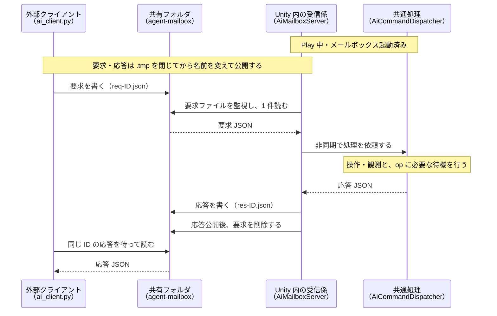
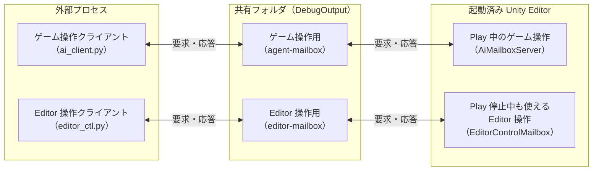

# はじめかた

本ライブラリを初めて導入し、環境構築から基本的な動作確認までを順に進める際に読むページである。
パッケージの導入手順から、外部からの操作、ゲーム内状態の観測登録、実機ビルドでの自律実行と接続方法までを網羅している。
手順通りに進めることで、画面の構造化テキスト変換とそれを用いた基本操作を一通り実現できるようになる。

## 1. 導入

### パッケージとして入れる（推奨）

`Packages/manifest.json` に追加する。

```json
{
  "dependencies": {
    "com.pisuke.unitestify": "https://github.com/MasaKoha/UniTestify.git",
    "com.unity.inputsystem": "1.14.0"
  }
}
```

- 必要なパッケージ: Input System（生入力の注入に使う。無ければ `submit` / `move` 等の UI 経路だけ動く）、uGUI（TextMeshPro を含む）
- 任意: Unity 公式 CLI `com.unity.pipeline`。入れると `unity command ai_*` から同じ機能を叩ける（`TESTIFY_PIPELINE` define が自動で立つ）

### コピーして入れる（利用側で改造したい場合）

リポジトリ直下の `Runtime/ Editor/ Pipeline/ Tests/ Tools/ package.json` を利用側の `Assets/UniTestify/` へ置く。継続的に追従するなら `rsync` で同期する（`architecture.md`）。

## 2. Play 中にメールボックスを起動する

既定の AI クライアントは **ファイル I/O** で Unity と話す（サンドボックスから localhost に届かない環境でも使える）。Unity 側の `AiMailboxServer` が `DebugOutput/agent-mailbox/` を監視し、`req-*.json` を処理して `res-*.json` を書く。実機への HTTP 接続は [後述の接続手順](#6-実機へ-http-で一手ずつ接続する) を使う。



クライアントが要求を書き、Unity が処理して応答を書き、クライアントが同じ識別子の応答を読む往復を示します。

起動方法は 3 つ（どれか 1 つ）:

1. **自動起動**: Play を始める前に `DebugOutput/agent-mailbox/.enabled` を置く。`ai_client.py` は初回に自動で置く
2. Editor メニュー `UniTestify/Mailbox/Start`（`Stop` で停止）
3. Unity 公式 CLI: `unity command ai_mailbox --start`（`--status` で間隔と最終処理時刻）

### Editor 操作（Play 停止中も利用可能）

パッケージを読み込んだ Editor では `EditorControlMailbox` が自動で常駐し、
プロジェクト直下の `DebugOutput/editor-mailbox/` を監視する。開始メニューや `.enabled` は不要。
`editor_ctl.py` で、起動済み Editor の Play / Stop / Pause / フォーカス / メニューを操作できる。



ゲーム操作と Editor 操作が、それぞれ別のクライアントとメールボックスを通る構成を示します。

Unity プロジェクトのルートから実行する:

```sh
EDITOR_CLIENT=Packages/com.pisuke.unitestify/Tools/editor_ctl.py   # コピー導入なら Assets/UniTestify/Tools/editor_ctl.py

python3 "$EDITOR_CLIENT" status
python3 "$EDITOR_CLIENT" play
python3 "$EDITOR_CLIENT" status
python3 "$EDITOR_CLIENT" pause
python3 "$EDITOR_CLIENT" unpause
python3 "$EDITOR_CLIENT" focus_game_view
python3 "$EDITOR_CLIENT" simulator_view
python3 "$EDITOR_CLIENT" menu 'Window/General/Console'
python3 "$EDITOR_CLIENT" stop
python3 "$EDITOR_CLIENT" status
```

出力は `{"ok":true,"message":"…"}` の一行 JSON。`play` / `stop` / `pause` の
成功は**要求受理**で、状態変更は応答後の Editor 更新で行う。
`status` の `message` に `isPlaying=True` が現れるまで照会して Play 開始を確認する。
停止確認は `isPlaying=False`、Pause 確認は `isPaused=True`、解除確認は `isPaused=False`。
`isCompiling=True` の間は `status` 以外が `ok:false` になるため、コンパイル完了を確認してから再要求する。
`simulator_view` は Device Simulator を前面に出す。利用できない環境では `ok:false` を返す。

`--mailbox DIR` を省略すると、カレントから親へ `DebugOutput/editor-mailbox` を探索する。
初回は `Assets/` と `ProjectSettings/` のある親も探す。パッケージリポジトリから
`TestProject/` の Editor を操作する場合は `--mailbox TestProject/DebugOutput/editor-mailbox` を指定する。
Runtime 用の環境変数 `TESTIFY_MAILBOX` は参照しない。
`--timeout` は応答待ちの秒数（既定 60 秒）。終了コードは成功 0、失敗 1。
タイムアウト時は要求が残り、後から実行される場合がある。
要求・応答と全 op は [Editor メールボックス](ops-reference.md#editor-メールボックス) を参照。

## 3. クライアントから操作する

```sh
CLIENT=Packages/com.pisuke.unitestify/Tools/ai_client.py   # コピー導入なら Assets/UniTestify/Tools/ai_client.py

python3 $CLIENT ping
python3 $CLIENT agent.begin '{"goal":{"freePlay":true,"maxSteps":5000,"maxSeconds":14400}}'
python3 $CLIENT agent.observe
python3 $CLIENT agent.act '{"action":{"submit":"NewGameButton"}}'
python3 $CLIENT agent.act '{"steps":[{"press":"east"},{"submit":"TabButton1","expect":[{"kind":"textVisible","value":"アイテム"}]}]}'
python3 $CLIENT agent.find '{"label":"雷撃"}'
python3 $CLIENT agent.act '{"action":{"scrollTo":"ShopItemRow8"}}'
python3 $CLIENT agent.observe '{"capture":"market"}'
python3 $CLIENT console '{"count":40,"level":"error"}'
python3 $CLIENT agent.export '{"name":"my-tour"}'
python3 $CLIENT agent.end
```

- 出力は 1 行目がメタ情報の JSON（`ok` / `settled` / `ready` / `elapsedMs` …）、2 行目以降が観測テキスト
- メールボックスの場所は `--mailbox DIR` → 環境変数 `TESTIFY_MAILBOX` → カレントから上へ `DebugOutput/agent-mailbox` を探索、の順で決まる

### Claude Code から

- 上のクライアントをそのまま Bash から叩く。Unity 公式 CLI があれば `unity command ai_agent_observe` 等の同期版も使える（こちらは落ち着き待ちをしない）
- 回帰撮影はシナリオ JSON を `scenario.run` op（またはランナーのメニュー）で流す。撮った PNG は画像で確認する

### Codex から

- localhost に届かないサンドボックスではメールボックスを使う。ネットワークが許可されたホストから実機へ接続する場合は HTTP を使える。Codex には「このクライアントだけを使う。Unity を起動・終了しない」と指示する
- 指示書のひな形は利用側リポジトリに置く。「どの画面を辿るか」「何を報告するか」を書き、AI は `observe` の文字を根拠に判断する

## 4. ゲーム側の状態を観測に載せる（任意だが強く推奨）

観測テキストの `game:` 行に、ゲーム固有の値（ゴールド・HP・フロア）を出せる。AI が画像を見ずに数値を突き合わせられる。

```csharp
#if UNITY_EDITOR || DEVELOPMENT_BUILD
using UniTestify;

public sealed class MyGameStateProvider : IGameStateProvider
{
    public IReadOnlyDictionary<string, object> GetState()
    {
        return new Dictionary<string, object> { ["gold"] = _assets.Gold, ["battle.ally.0.hp"] = _allies[0].CurrentHp };
    }
}

// 起動時（DI のビルドコールバック等）
GameAdapterRegistry.StateProvider = new MyGameStateProvider(...);
GameAdapterRegistry.BusyProvider = new MyGameBusyProvider(...);   // 遷移・演出中を IsBusy で返すと act が待ってくれる
GameAdapterRegistry.CommandHandler = new MyGameCommandHandler(...); // 素材付与などのデバッグコマンド（任意）
#endif
```

- `IGameBusyProvider.IsBusy` が true の間、`agent.act` は「落ち着いていない」として観測を待ち、観測に `agent: busy=<Reason>` が出る。ローディングオーバーレイや入力ブロックの状態をそのまま返せばよい

### アダプタ注入（Editor 限定・任意）

`com.unity.pipeline` によって `TESTIFY_PIPELINE` が有効な Editor では、利用側リポジトリへ
アダプタをコミットせず、外部ディレクトリのソースをセッション開始時にコンパイル・登録できる。
`TestProject/` の既定 manifest には Pipeline が入っていないため、この機能の確認には利用側で導入する。
実 API のソース確認は `0.6.0-exp.1` で行った。設計時点の `0.4.0-exp.1` はこの環境に無く、互換性は未確認。

たとえば `<Unity プロジェクト>/DebugOutput/adapters/SessionBusyProvider.cs` に次を置く。

```csharp
namespace SessionAdapters
{
    using UniTestify;

    /// <summary>注入した busy 判定が観測へ届くことを確認するアダプタです。</summary>
    public sealed class SessionBusyProvider : IGameBusyProvider
    {
        /// <summary>注入の動作確認中は操作を受け付けない状態にします。</summary>
        public bool IsBusy => true;

        /// <summary>組み込みの busy 理由と区別するための識別子です。</summary>
        public string Reason => "adapter-injected";
    }
}
```

PlayMode でセッションを開始する。

```bash
python3 "$CLIENT" agent.begin '{"goal":{"freePlay":true},"options":{"adaptersDirectory":"DebugOutput/adapters"}}'
```

最初の観測に `agent: busy=adapter-injected` が出れば登録が反映されている。
実際の運用では `IsBusy` と `Reason` をゲーム側の状態判定へ差し替える。
登録だけを行う場合は `python3 "$CLIENT" adapters.load '{"directory":"DebugOutput/adapters"}'` を使う。
`directory` / `options.adaptersDirectory` は Unity プロジェクトからの相対パス、またはリポジトリ外の絶対パスを指定できる。

対象は指定ディレクトリ直下の `*.cs`。ファイルパスの昇順で改行を挟んで連結するため、
複数ファイルの `using` は例のように各ブロック namespace 内に置く。
登録対象は `IGameStateProvider` / `IGameBusyProvider` / `IGameCommandHandler` を実装する、
公開の引数なしコンストラクタを持つ非抽象クラス。複数契約を持つ型は同じインスタンスを共有する。
同じ完全型名（名前空間を含む）が登録済みならスキップする。登録窓口は契約ごとに一つで、異なる型なら後の登録が置き換える。
再読込は同じ型の差し替えには使えず、ドメインリロード後は再注入が必要。

`adaptersDirectory` の省略・空文字では注入しない。注入に失敗した `agent.begin` は新しいセッションを開始せず、
`ok:false` と `message` に診断・例外の原文を返す。Pipeline 未導入または Player では
`message:"TESTIFY_PIPELINE が無効です"` を返す。失敗前までに登録された型の巻き戻しは行わない。

## 5. 実機 Development Build で自律実行する

`ScenarioAutorun` が起動シーンの読み込み後に設定を一度読み、指定秒数後に `UiScenarioRunner.Run` を開始する。
メールボックスの起動・`.enabled` は不要。待機は `Time.timeScale` に依存しない実時間。
シナリオ実行後もアプリは終了しない。設定が残っていれば、次回のアプリ起動／Editor の Play 開始でも実行する。

### 初回起動用の設定をビルドへ含める

初回起動前は `persistentDataPath` 配下へ設定ファイルを置けないため、
付属の `Runtime/Resources/UniTestifySettings.asset` を Inspector で編集して Development Build に含める。
`Resources.Load<UniTestifySettings>("UniTestifySettings")` で読み込まれる。

| フィールド | 既定値 | 指定する内容 |
|---|---|---|
| `autorunScenarioPath` | 空文字 | シナリオ JSON のパス。空なら自律実行しない |
| `autorunDelaySeconds` | `2` | 起動シーン読み込み後の待機秒数。0 は待機なし。有限の 0 以上 |

- コピー導入なら `Assets/UniTestify/Runtime/Resources/UniTestifySettings.asset` を編集する。
- UPM 導入ならパッケージを埋め込み／ローカル化して、パッケージ内の付属アセットを編集する。
- アセットを作り直す場合は `Assets > Create > UniTestify > Settings` で作成し、
  上記の `Runtime/Resources/UniTestifySettings.asset` に置く。同じ Resources パスの設定アセットは 1 個にする。

このアセットに入るのは設定だけで、シナリオ本体はコピーされない。
シナリオは `persistentDataPath` 配下、または設定で指すファイルとして読み取れるパスへ別途配置する。
初回から実行する場合も、指定した待機時間の終了までにそのパスでシナリオを読める状態にする。
Android の APK 内 `StreamingAssets` を `UnityWebRequest` で読む処理は含まない。

### 外部ファイルで上書きする

実機の `<Application.persistentDataPath>/DebugOutput/scenario-autorun.json` に置く:

```json
{"path":"scenarios/tour.json","name":"device-tour","delaySeconds":2.0}
```

`path` / `name` は文字列、`delaySeconds` は有限の 0 以上の数値。
JSON の指定フィールドがビルド設定を上書きし、省略フィールドはビルド設定を維持する。
`name` の省略・空文字はシナリオファイルの拡張子を除いた名前を使う。
`{"path":""}` でビルド時の自律実行を無効にできる。壊れた JSON・型違い・不正な秒数はログへ出して起動を中止する。

相対パスは Editor では Unity プロジェクトルート、実機では `Application.persistentDataPath` を基準にする。
上の例の実機シナリオ本体は `<persistentDataPath>/scenarios/tour.json`。
絶対パスも指定できる。この基準は `scenario.run` の `path` と、`capture` / `agent.observe` の
`directory` 指定でも共通。撮影先を省略すると `<DebugOutputPath.DirectoryPath>/captures` になる。
シナリオ本体の `outputDirectory` は既存仕様のままなので、実機で既定出力先を使う場合は省略する。

### Android へ配置・結果を回収する

Development Build をインストールして一度起動し、実際の `Application.persistentDataPath` を確認して停止する。
Android では通常 `/storage/emulated/0/Android/data/<アプリID>/files`。
実際の端末のパスを使う（[Unity の persistentDataPath](https://docs.unity3d.com/ScriptReference/Application-persistentDataPath.html)）。
次のアプリ ID・起動 Activity・永続データパスは対象ビルドに合わせる:

```sh
APPLICATION_ID='com.example.game'
LAUNCH_COMPONENT='com.example.game/com.unity3d.player.UnityPlayerActivity'
DEVICE_DATA="/storage/emulated/0/Android/data/${APPLICATION_ID}/files"
DEVICE_OUTPUT="${DEVICE_DATA}/DebugOutput"

adb shell am force-stop "$APPLICATION_ID"
adb shell mkdir -p "$DEVICE_OUTPUT" "${DEVICE_DATA}/scenarios"
adb push ./tour.json "${DEVICE_DATA}/scenarios/tour.json"
adb push ./scenario-autorun.json "${DEVICE_OUTPUT}/scenario-autorun.json"
adb shell rm -f "${DEVICE_OUTPUT}/scenario-autorun.done.json"
adb shell am start -n "$LAUNCH_COMPONENT"
```

完了時に `DebugOutput/scenario-autorun.done.json` ができる。内容は結果の絶対パスと既存ランナーの判定:

```json
{"path":"<persistentDataPath>/DebugOutput/scenario-results/device-tour-<日時>-<識別子>/result.json","verdict":"pass"}
```

前回の完了ファイルは自律実行の待機開始前に削除する。結果は起動ごとのディレクトリへ保存し、過去の結果を上書きしない。
シナリオが開始できない場合や結果を保存できない場合は、完了ファイルを生成せず `[ScenarioAutorun]` のログへ理由を出す。
完了ファイルの生成後に回収する:

```sh
adb pull "${DEVICE_OUTPUT}/scenario-autorun.done.json" ./scenario-autorun.done.json
adb pull "$DEVICE_OUTPUT" ./device-DebugOutput
```

回収した `result.json` の `verdict` を、同じシナリオを Editor で実行した結果と比較する。
`tap` / `swipe` / `pinch` を含むシナリオでは、仮想 `Touchscreen` の入力が実機 UI に届くことも依頼者が確認する。

### Standalone / Editor の起動引数

```sh
./Game -unitestify-scenario scenarios/tour.json
```

`-unitestify-scenario <path>` はパスだけを JSON より後に上書きする。名前と待機秒数は JSON／ビルド設定を使う。
`-` で始まるファイル名は `./` を付けるか絶対パスで指定する。
Editor も同じ起動引数を受け、Play 開始時に実行する。Editor の外部設定と成果物はプロジェクト直下の `DebugOutput/`。
Android ではこの起動引数を読まない。

## 6. 実機へ HTTP で一手ずつ接続する

### ビルド前の設定

T5 と同じ `Runtime/Resources/UniTestifySettings.asset` を編集し、Development Build に含める。
初回起動前の外部ファイル配置は不要。自律実行用の `autorunScenarioPath` は空のままでよい。

| フィールド | 設定例 | 既定値 |
|---|---|---|
| `httpEnabled` | `true` | `false` |
| `httpPort` | `7910` | `7910`（0 なら自動割り当て） |
| `httpToken` | 自分で決めたトークン | 空（起動ごとに生成） |
| `httpAllowLan` | USB・同一 PC は `false`、Wi-Fi は `true` | `false` |

トークンは空白を含まない ASCII 可視文字で指定する。
起動シーンの読み込み後、`AiHttpServer` が有効な設定のときだけ開始し、シーン遷移後も常駐する。
Editor では Play 中だけ動く。メールボックス用 `.enabled` は不要。
`DebugOutputPath.DirectoryPath/http.enabled` に同じキーの JSON があれば、指定した項目だけ上書きする:

```json
{"httpEnabled":true,"httpPort":7910,"httpAllowLan":false}
```

変更は次回のアプリ起動／Editor の Play 開始で反映する。`{"httpEnabled":false}` で無効化できる。
待受成功後、同じディレクトリの `http.port.json` に `{"port":7910,"token":"…"}` を書く。
ポートを 0 にした場合は、この `port` を端末側の転送先に使う。
空トークンから生成した場合は、この `token` をホストへコピーする。

### Android（USB / adb forward）

Player Settings の **Other Settings > Configuration > Internet Access を Require** にする。
`HttpListener` を使うため、Manifest の `android.permission.INTERNET` を確実に含める。
[Unity の Android Player Settings](https://docs.unity3d.com/Manual/class-PlayerSettingsAndroid.html) を参照。

Development Build を起動し、ホストへ USB 接続した状態で実行する。
`CLIENT` は導入方法に合わせた `ai_client.py` のパス、トークンはビルド設定と同じ値にする:

```sh
CLIENT=Packages/com.pisuke.unitestify/Tools/ai_client.py
export TESTIFY_HTTP_TOKEN='replace-with-your-token'
adb forward tcp:7910 tcp:7910

python3 "$CLIENT" --transport http --url http://127.0.0.1:7910 ping
python3 "$CLIENT" --transport http --url http://127.0.0.1:7910 agent.begin '{"goal":{"freePlay":true}}'
python3 "$CLIENT" --transport http --url http://127.0.0.1:7910 agent.observe
python3 "$CLIENT" --transport http --url http://127.0.0.1:7910 agent.act '{"action":{"submit":"NewGameButton"}}'
```

`agent.observe` は既存実装どおり、先に `agent.begin` でセッションを開始する必要がある。
観測出力は Editor のメールボックスと同じ形式（メタデータ JSON ＋ 観測本文）。
自動生成した接続情報は実際の `persistentDataPath` を使って回収する:

```sh
APPLICATION_ID='com.example.game'
DEVICE_OUTPUT="/storage/emulated/0/Android/data/${APPLICATION_ID}/files/DebugOutput"
adb pull "${DEVICE_OUTPUT}/http.port.json" ./http.port.json
```

`http.port.json` の `token` を `TESTIFY_HTTP_TOKEN` へ設定する。
例えば実ポートが 54321 なら `adb forward tcp:7910 tcp:54321` とし、ホストの URL は 7910 のまま使える。
操作終了後は `agent.end` を送り、`adb forward --remove tcp:7910` で転送を閉じる。

### iOS（USB / iproxy）

Development Build を起動し、端末を USB 接続してホストとの信頼を済ませる。
`httpAllowLan:false` のまま、libusbmuxd の `iproxy` を別ターミナルで動かし続ける:

```sh
iproxy 7910 7910
```

これはホストの 7910 を端末の 7910 へ転送する。
上の Android 例と同じ `TESTIFY_HTTP_TOKEN` と `--url http://127.0.0.1:7910` を使い、
`agent.begin` → `agent.observe` → `agent.act` の順に呼ぶ。
ポート 0・トークン空の場合は Xcode の Devices and Simulators などでアプリコンテナの
`persistentDataPath/DebugOutput/http.port.json` を回収し、実際のポートとトークンを使う。
初回は固定ポートとトークンをビルド設定へ含めると回収せずに接続できる。
`iproxy` の現行 `7910:7910` 表記と従来の `7910 7910` 表記は
[libusbmuxd の実装](https://github.com/libimobiledevice/libusbmuxd/blob/master/tools/iproxy.c) で確認できる。

### iOS（同一 Wi-Fi）

`httpAllowLan:true` とし、ホストと端末を同じ LAN へ接続する。
`iproxy` を介さず、端末の IPv4 アドレスを指定する:

```sh
python3 "$CLIENT" --transport http --url http://192.168.1.20:7910 agent.begin '{"goal":{"freePlay":true}}'
python3 "$CLIENT" --transport http --url http://192.168.1.20:7910 agent.observe
```

LAN 許可でもトークンは必須。実際のインターフェースのサブネットと一致する接続元だけを許可する。
Unity 同梱 Mono では IPv6 のプレフィックス長が未実装のため、その環境の LAN 接続には IPv4 を使う。
IPv6 のループバックは許可判定に対応する。

iOS の LAN 利用ではローカルネットワークのプライバシー確認に対応し、
アプリが LAN アクセスを要求する場合は `Info.plist` に `NSLocalNetworkUsageDescription` を用意する。
ただし、設計表の「LAN 許可時に確認が出る」は OS 上の保証ではない。
Apple は **TCP の待受・受信だけではローカルネットワーク許可を要求しない** としているため、
T9 の待受だけでは確認が出ない場合がある。ループバックのみの接続は LAN アクセスを要求しない。
確認表示を強制するための探索・送信は追加していない。
[Apple TN3179](https://developer.apple.com/documentation/technotes/tn3179-understanding-local-network-privacy) を参照。

### PC Standalone（直接接続）

同じ PC 上の Development Build は `adb` / `iproxy` 不要。
アプリを起動し、`TESTIFY_HTTP_TOKEN` を設定して `--url http://127.0.0.1:7910` で接続する。
`agent.begin` 後の `agent.observe` が Editor と同じ観測形式を返すことを確認する。
別 PC から接続する場合は `httpAllowLan:true` とし、同一 LAN のアプリ側アドレスを指定する。
アプリは前面で動作させる。バックグラウンドで Unity のフレームが止まると、コマンドも完了しない。

## 7. うまくいかないとき

| 症状 | 見るところ |
|---|---|
| `ok:false, error:"応答待ちがタイムアウト"` | Play 中か、`.enabled` を置いた後に Play を始めたか。`UniTestify/Mailbox/Start` で手動起動 |
| HTTP 接続できない | Development Build と `httpEnabled`、`http.port.json` の実ポート、USB 転送、アプリのフレーム進行、`[AiHttpServer]` の起動エラーを確認 |
| HTTP `401` | `TESTIFY_HTTP_TOKEN` が今回の `http.port.json` の token またはビルド設定と一致するか |
| HTTP `403` | USB 転送ならループバックか。LAN なら `httpAllowLan:true`、同一サブネット、IPv4 の接続先か |
| `playMode が必要です` | `agent.*` は PlayMode 専用 |
| `目標 JSON に期待値がありません` | `{"goal":{"freePlay":true}}` か `{"goal":{"goal":[{"kind":…}]}}` の形にする |
| `submit 対象が見つかりません` | `agent.find` で名前を確認。同名行は `label:<部分一致>` で指定 |
| 撮影が `blank:true` | 一様な画面（ローディング等）。遷移後に撮り直す |
| 観測に画面外の行が出ない | 既定 `scope:"visible"`。全部見るなら `scope:"all"`（`[clipped]` / `blocked:` が付く） |
