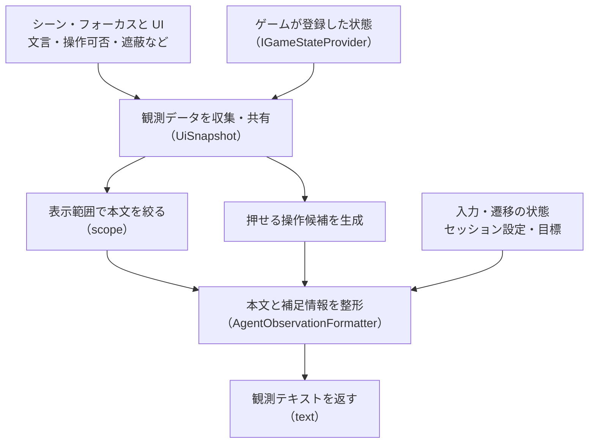

# op リファレンス

本ライブラリで利用可能な命令の具体的な仕様や記述方法を確認したいときに参照するページである。
すべての命令における引数と応答の形式、観測テキストの読み方、行動や事後条件の語彙を網羅している。
全体の概要を把握した開発者が、実装や自動テストの記述にあたって正確な仕様を調べる際に役立つ。

Runtime の op は `AiCommandDispatcher` が実装し、メールボックス（`req-*.json`）、HTTP（`POST /op`）、Unity 公式 CLI（`unity command ai_*`）から同じ意味で呼べる。
**メールボックスと HTTP 経路は非同期**で、操作後の落ち着き待ち・撮影のファイル生成待ち・シナリオの完了待ちを済ませてから応答する。CLI 経路は同期で、要求した時点の結果を返す。

Play 停止中も使う [Editor メールボックス](#editor-メールボックス) は `EditorControlMailbox` が処理する独立した入口。

**AI がゲームを操作したあとは必ず Play を止める。Play を残すのは、人に直接触ってもらうときだけ。**
Play の放置は CPU を占有し、後続のコンパイルやテストが弾かれる原因になる。
Editor メールボックスの `stop` を送り、`status` で `isPlaying=False` になったことまで確認する。
`agent.end` はセッションの終了であり、Play の停止にはならない。

## 要求・応答の形

要求（`req-<id>.json`）:
```json
{ "op": "agent.act", "args": "{\"action\":{\"submit\":\"NewGameButton\"}}" }
```
`args` は JSON 文字列。`ai_client.py` は第 2 引数の JSON をそのまま詰める。

応答（`res-<id>.json`）の共通フィールド:

| フィールド | 意味 |
|---|---|
| `ok` | 処理できたか。`false` のとき `error` か `message` に理由 |
| `op` | 要求した op |
| `session` | エージェントセッション ID（`agent.*`） |
| `message` | 人向けの補足（`セッションを開始しました。` 等） |
| `text` | 本文（観測テキスト・検索結果・ログ） |
| `path` | 成果物の絶対パス（撮影 PNG・scenario.json・結果 JSON） |
| `settled` | 非同期経路で落ち着き待ちを済ませたか。待機だけの `agent.act` はアンカー成立時に true |
| `ready` / `waitedMs` | 非同期 `agent.act` のアンカーと操作対象の準備が成立したか、両方の待機に費やした合計ミリ秒 |
| `elapsedMs` | 要求受理から応答までの実時間 |
| `width` / `height` / `blank` | 撮影の画像サイズと白紙判定（輝度の標準偏差 3.0 未満） |
| `view` | 今回フォーカスを適用した `game` / `simulator`。未指定・適用不能時は空文字列 |
| `expectOk` / `expectFailures` | `expect` の判定結果と未達の理由 |
| `status` / `verdict` / `failedSteps` / `warningCount` | シナリオ実行の状態と合否 |

## HTTP 入口

`AiHttpServer` が Editor の Play 中または Development Build で `http://+:<port>/` を待ち受ける。
新しい op はなく、既存の `AiCommandRequest` / `AiCommandResponse` をそのまま使う。
拡張計画表の `AiMailboxRequest` に相当する実在の型は `AiCommandRequest`。

```http
POST /op HTTP/1.1
Host: 127.0.0.1:7910
Authorization: Bearer <token>
Content-Type: application/json; charset=utf-8

{"op":"agent.observe","args":"{}"}
```

応答の Content-Type は `application/json; charset=utf-8`。本文は上記の共通応答 JSON 全体で、
観測は `text` に入る。外側の要求 JSON を検証後、メインスレッドで `ExecuteAsync` を一件ずつ実行する。
`args` の省略・空文字は従来どおりディスパッチャが解決し、不正な引数や未知 op は既存の失敗応答になる。

| HTTP ステータス | 条件 |
|---|---|
| `200` | ディスパッチャの応答。op の成否は `ok` で判定する |
| `400` | 本文を要求の JSON オブジェクトとして復元できない |
| `401` | `Authorization: Bearer <token>` が未指定または不一致 |
| `403` | 接続元が許可対象外（認証より先に判定） |
| `404` | `/op` 以外のパス |
| `405` | `/op` に対する POST 以外のメソッド |

入口で生成するエラーも `AiCommandResponse` の `ok:false` / `error` を返す。
`IPAddress.IsLoopback`（IPv4 射影 IPv6 は正規化）を既定の許可条件とする。
`httpAllowLan:true` の場合だけ、稼働中の非ループバック・非トンネル・非 PPP インターフェースと
同じサブネットからの接続も許可する。プライベート IP というだけでは許可しない。
IPv4 は `IPv4Mask`、IPv6 は提供される環境で `PrefixLength` を使う。
Unity 同梱 Mono などで IPv6 のプレフィックス長を取得できない場合、その IPv6 LAN 接続は拒否する。
その環境の Wi-Fi 接続は IPv4 アドレスを指定する。IPv6 ループバックはこの制約を受けない。

### 起動設定と接続情報

`AfterSceneLoad` で `Resources/UniTestifySettings.asset` の以下の値を読み、
`DebugOutputPath.DirectoryPath/http.enabled` があれば JSON の指定キーだけを上書きする。
起動後のファイル変更は次回起動から反映する。空のマーカーファイルではなく JSON を置く。

```json
{"httpEnabled":true,"httpPort":7910,"httpToken":"replace-with-your-token","httpAllowLan":false}
```

| キー | 既定値 | 意味 |
|---|---|---|
| `httpEnabled` | `false` | HTTP 入口を起動する。外部 JSON の `false` でビルド設定を無効にできる |
| `httpPort` | `7910` | 0～65535 の整数。0 は起動時に空きポートを自動割り当て |
| `httpToken` | 空文字 | 空なら起動ごとに生成。指定する場合は空白を含まない ASCII 可視文字 |
| `httpAllowLan` | `false` | 同一 LAN の接続元も許可する。Bearer 認証は引き続き必須 |

壊れた JSON・型違い・範囲外のポートはログを出して起動を中止する。
待受成功後に実ポートと実効トークンを `DebugOutputPath.DirectoryPath/http.port.json` へ書く:

```json
{"port":7910,"token":"<この起動のトークン>"}
```

設定アセット自体は変更しない。前回の接続情報は起動時に削除し、正常停止時にも削除する。
`DebugOutputPath` の場所は Editor でプロジェクト直下、実機で `persistentDataPath` 配下。

### クライアント

`ai_client.py --transport file|http` の既定値は `file`。`http` では `--url http://HOST:PORT` と
環境変数 `TESTIFY_HTTP_TOKEN` を指定する。URL に `/op` を付けず、クライアントが付加する。
HTTP ではメールボックスの探索・ファイル生成を行わない。`--timeout` は両 transport 共通（既定 60 秒）。
タイムアウトや切断後も受理済みの op が実行される場合がある。
標準出力は既存どおり **1 行目が `text` を除いたメタデータ JSON、以降が観測本文**。
終了コードは `ok:true` が 0、失敗が 1。HTTP エラーも本文の共通応答を同じ形式で出力する。
`agent.observe` には従来どおり事前の `agent.begin` が必要。
実機の接続例は [接続手順](getting-started.md#6-実機へ-http-で一手ずつ接続する) を参照。

## 一覧

| op | 引数 | 説明 |
|---|---|---|
| `ping` | – | `playMode=<bool> scene=<name> frame=<n>` |
| `ops` | – | op 名の一覧 |
| `adapters.load` | `directory`（必須。プロジェクト相対または絶対パス） | Editor 限定。直下の `*.cs` をコンパイルし、`IGameStateProvider` / `IGameBusyProvider` / `IGameCommandHandler` の実装を登録 |
| `agent.begin` | `goal`（必須）, `options` | セッション開始。`goal` は `{"freePlay":true,"maxSteps":5000,"maxSeconds":14400}` か `{"goal":[{"kind":"textVisible","value":"…"}],"maxSteps":…}`。期待値 0 件で freePlay でもない目標は拒否。`options`: `{"stuckRepeatLimit":40,"inputMode":"gamepad","settleFrames":1,"adaptersDirectory":"DebugOutput/adapters"}`。`adaptersDirectory` 指定時はセッション生成前に注入 |
| `agent.observe` | `diffOnly`, `scope`（`visible` 既定 / `all`）, `capture`（撮影名）, `directory`, `view`（`""` 既定 / `game` / `simulator`） | 観測テキスト。`capture` を付けると同じフレームで撮影し `path/width/height/blank` を埋める。`view` の経路別動作は下記 |
| `agent.act` | `action` または `steps[]`（各手に `waitForText` / `waitForObject` / `waitForFocus` / `waitForScene`、`timeoutSeconds`(30)）, `expect[]`, `settleSeconds`(0.35), `settleTimeoutSeconds`(10), `readyTimeoutSeconds`(5) | 各手: アンカー待ち → 対象の準備待ち → 実行 → 落ち着き待ち → 観測。待機だけも可。待機失敗・`status` が `running` 以外・`expect` 未達で打ち切り |
| `agent.find` | `label`, `kind`（Button/Text/Toggle/Input/Selectable）, `scope` | ラベル部分一致で要素検索。1 行 1 件、末尾に推奨の `submit:"…"` |
| `agent.goal` | – | 目標達成状態 |
| `agent.end` | – | セッション終了（`session.json` / `actions.jsonl` を確定） |
| `agent.export` | `name` | セッションの手順を回帰シナリオ `scenario.json` に書き出す。`expect` 付きの手はそのまま、未達だった手は `comment` 付き |
| `scenario.run` | `path`（Editor はプロジェクト相対、実機は persistentDataPath 相対、または絶対）, `name`, `scenarioTimeoutSeconds`(900) | シナリオ実行。非同期経路は完了まで待って `verdict` を返す |
| `scenario.status` | – | 直前のシナリオの状態 |
| `capture` | `name`（必須。英数字・`_`・`-`）, `directory`（既定 `DebugOutput/captures`）, `view`（`""` 既定 / `game` / `simulator`） | 画面を PNG に。`view` で Game View / Device Simulator を指定できる |
| `snapshot` | `compact`(true), `save` | UI スナップショット（`all` 相当。ツール用） |
| `scene.dump` | `depth`(3), `maxNodes`(200), `filter`（名前の部分一致、任意）, `save`(false) | シーン階層のコンパクトテキスト。`save` で全階層 JSON を `DebugOutput/scene/` に保存し `path` を返す |
| `console` | `count`(40), `level`（`all` / `error`） | Unity コンソールの末尾。Error/Exception はスタックトレース先頭 3 行付き |

## アダプタ注入

```bash
python3 "$CLIENT" adapters.load '{"directory":"DebugOutput/adapters"}'
python3 "$CLIENT" agent.begin '{"goal":{"freePlay":true},"options":{"adaptersDirectory":"DebugOutput/adapters"}}'
```

`adapters.load` は共通ディスパッチャの同期・非同期入口から Editor のメインスレッド上でコンパイルする。
単独の `adapters.load` は PlayMode 不要。`agent.begin` は従来どおり PlayMode が必要で、
目標・PlayMode の検証後、既存セッションの破棄と新規セッション生成より前に注入する。
`options.adaptersDirectory` の省略・空文字では呼び出さない。

- `directory` は必須。直下の `*.cs` だけをファイルパス昇順で連結し、サブディレクトリは探索しない。
  絶対パスなら利用側リポジトリ外も指定できる。複数ファイルは `using` を各ブロック namespace 内に置く。
- 公開の引数なしコンストラクタを持つ非抽象・型引数確定済みの実装クラスを登録する。
  名前空間を含む同じ型名が登録済み、または同じ要求内で登録済みなら構築せずスキップする。
  一つの型が複数契約を実装していれば一つのインスタンスを共有する。
- レジストリは各契約一つ。異なる型の登録はその窓口を置き換える。ドメインリロードで失われ、再注入が必要。
- 成功時は `ok:true`、`op:"adapters.load"`、`message:"アダプタを登録しました。登録型数=N"`。
  `N` は今回新たに登録した型数で、全件スキップ・非該当の場合は 0。共通応答の新規フィールドはない。
- Loader 未登録（Pipeline 無効・Player）では `ok:false, message:"TESTIFY_PIPELINE が無効です"`。
  ソースなし・パス不正・コンパイル・型列挙・コンストラクタの失敗も `ok:false` とし、
  `message` にコンパイル診断や内部例外を含む例外原文を返す。
  注入に失敗した `agent.begin` はそのメッセージを返して新規セッションを開始しない。
  失敗前の登録は巻き戻さない。

Pipeline の現物 `0.6.0-exp.1` に合わせ、internal API 名を定数に集約して反射呼び出しする。
戻り値は `HotReloadCompileResult` で、`AssemblyName` に一致するロード済みアセンブリから型を取得する。
既定の `OutputPath` は実ファイルとして保存されないため使用しない。設計基準の `0.4.0-exp.1` との互換性は未確認。

## 実機のパスと自律実行

`DebugOutputPath.DirectoryPath` は Editor で `<Unity プロジェクト>/DebugOutput`、
実機 Development Build で `<Application.persistentDataPath>/DebugOutput`。
`capture` / `agent.observe` の `directory` と `scenario.run` の `path` は、
Editor ではプロジェクトルート、実機では `persistentDataPath` を基準に相対解決する。絶対指定も可。

自律実行は op を追加せず、起動シーン読み込み後に独立して始まる。`.enabled` は不要。
`Resources/UniTestifySettings.asset` の `autorunScenarioPath`（空なら無効）と
`autorunDelaySeconds`（既定 2 秒）に、`DebugOutput/scenario-autorun.json` の
`path` / `name` / `delaySeconds` の指定項目を上書きする。
Standalone / Editor の `-unitestify-scenario <path>` はさらにパスだけを上書きする。
完了通知は `DebugOutput/scenario-autorun.done.json`:

```json
{"path":"<結果ディレクトリ>/result.json","verdict":"pass"}
```

`path` は絶対パス、`verdict` は既存の結果 JSON と同じ `pass` / `fail` / `error`。
結果 JSON 自体と既存 op の応答フィールドは変更しない。
配置・取得の手順と既定値の詳細は [実機での使い方](getting-started.md#5-実機-development-build-で自律実行する) を参照。

## Editor メールボックス

`[InitializeOnLoad]` の `EditorControlMailbox` が `EditorApplication.update` で処理する。
場所は `<Unity プロジェクト>/DebugOutput/editor-mailbox/`。Play 停止中・Pause 中も利用できる。
Runtime 用の `agent-mailbox` / `AiCommandDispatcher` とは要求・応答を分ける。

要求 `req-<id>.json`:

```json
{"op":"menu","arg":"Window/General/Console"}
```

`arg` は普通の文字列。menu 以外は省略または空文字列にする。
`editor_ctl.py menu 'Window/General/Console'` のように、メニューパスを第2引数で渡す。

応答 `res-<id>.json` は **`ok`（bool）と `message`（string）の2項目のみ**。
`status` の状態値も `message` に格納する:

```json
{"ok":true,"message":"isPlaying=True isPaused=False isCompiling=False focusedWindow=UnityEditor.GameView"}
```

| op | arg | 応答の意味 |
|---|---|---|
| `status` | なし | `isPlaying` / `isPaused` / `isCompiling` / `focusedWindow`。bool は `True` / `False`、focusedWindow は前面 EditorWindow の完全型名（なければ空文字列） |
| `play` | なし | Play 開始の要求受理。開始完了は `status` で確認 |
| `stop` | なし | Play 停止の要求受理。停止完了は `status` で確認 |
| `pause` | なし | Pause の要求受理。反映は `status` で確認 |
| `unpause` | なし | `EditorApplication.isPaused = false` で Pause を解除 |
| `focus_game_view` | なし | T1 の `PlayModeViewFocus` で Game View をフォーカス。適用不能なら `ok:false` |
| `simulator_view` | なし | 同じ `PlayModeViewFocus` で Device Simulator をフォーカス。適用不能なら `ok:false` |
| `menu` | メニューパス（必須） | `EditorApplication.ExecuteMenuItem` の成否。失敗なら `ok:false` |

`play` / `stop` / `pause` は受理応答を公開してから、次の Editor 更新で状態変更を要求する。
応答を受けた直後は以前の状態の場合がある。呼び出し側が `status` を繰り返して確認する。
`isCompiling=True` の間は `status` 以外を `ok:false` で拒否する。
未知 op、不正 JSON、op / arg が文字列でない要求、空のメニューパスも `ok:false` と理由を返す。

ファイル公開は既存メールボックスと同じく、同一ディレクトリの `.tmp` を閉じてから rename する。
正式要求を名前順に1件ずつ処理し、応答を公開できた要求だけ削除する。
I/O 失敗時は応答を保持して書き込みを再試行し、同じ要求を実行し直さない。
ポーリング間隔は定数 0.05 秒。起動時の走査後はファイル通知で走査を予約し、
必要な間隔につき `Directory.GetFiles` は最大1回。待機中は通知フラグだけを確認し、空走査の確保を避ける。

## 撮影・観測対象（`view`）

`capture` と `agent.observe` が受ける。`"game"` は Game View、`"simulator"` は Device Simulator。
未指定・`""` は従来どおり前面の PlayModeView を使う。不正値は `ArgumentException` とし、
ディスパッチャが `ok:false` と `error` に変換する。

メールボックスでは `TryFocus` → `Screen.width/height` の安定待ち → 観測・撮影の順。
寸法が 2 フレーム連続して変化しなくなるまで、最大 5 フレーム待つ。上限に達した場合も従来処理へ進む。
待つのは観測の前だけで、`agent.observe` の観測から撮影要求の間には yield を挟まない。

```sh
python3 Tools/ai_client.py capture '{"name":"a","view":"simulator"}'
python3 Tools/ai_client.py agent.observe '{"capture":"b","view":"game"}'
```

対象の型・ウィンドウが利用できない場合、バッチモード、Handler 未登録時は、フォーカス不能を理由に失敗させず、
従来の対象で処理する。応答は `view:""`、`message` に適用できなかった理由を含む。
成功時の `view` は今回適用した値であり、`view` 未指定時に現在の前面ウィンドウを推定して返すものではない。

**同期 CLI は `--view` の適用成功時、フォーカスだけを行う。** その呼び出しでは撮影・観測を行わず、
`view` と次回呼び出しの案内を返す（`path` / `text` は空、`width=height=0`）。
Editor のフレーム反映後、次の呼び出しで `--view` を省略して撮影・観測する。
フォーカス不能時はメールボックスと同じく従来処理へ進む。フォーカス不要なら最初から `--view` を省略する。

```sh
unity command ai_capture --name a --view simulator
# Editor のフレーム反映後に、同じコマンドを view なしで呼ぶ。
unity command ai_capture --name a
```

`ai_agent_observe` も `--view` を受け、適用後は次の `ai_agent_observe` を `--view` なしで呼ぶ。
同 CLI の既存引数は `--diffOnly` のみで、`capture` / `directory` / `scope` は公開していない。
CLI で PNG が必要なら次の `ai_capture` を使う。観測と撮影を一要求にまとめる場合はメールボックスの `agent.observe` を使う。
CLI の撮影は従来どおり PNG の生成完了を待たず、`width=height=0` / `blank=false` を返す。

## 行動（`action`）の語彙

**行動はフィールド名で指定する。** `action` と `steps[]` の各要素では、クリックを
`{"click":"SettingsButton"}` と書く。`{"kind":"click","target":"SettingsButton"}` は誤り。
**`kind` / `target` は `expect` の語彙**であり、行動の種類・対象を指定するキーには使えない。

行動オブジェクトにキーが 1 個以上あり、`AgentAction` の実在フィールド名と一致するキーが 0 個なら、
`ok:false` と `error` を返す。`error` には受け取ったキーと正しい記述例を含め、`kind` または `target` が
あれば `expect` の語彙であることも案内する。正しいキーと未知キーの混在は従来どおり受け入れる。
空の `{}`、`expect` / `timeoutSeconds` だけの行動は従来どおり扱う。
`settleFrames` は `agent.begin` の `options` またはシナリオのステップに指定する項目で、行動のフィールドではない。

| キー | 例 | 意味 |
|---|---|---|
| `submit` | `"NewGameButton"` / `"label:炎 燃える護符"` / `"Panel/Row0"` | UI の決定。名前・パス断片・ラベル部分一致 |
| `press` | `south` `east` `north` `west` `start` `select` `leftShoulder` `rightShoulder` | パッド単打（`east` が B/戻る） |
| `hold` + `seconds` | | 長押し |
| `move` | `up` `down` `left` `right` | 十字キー（フォーカス移動） |
| `stick` + `x` `y` `seconds` | `left` / `right` | スティック |
| `key` | `Enter` `Escape` `Space` `ArrowUp` … | キーボード |
| `text` | | TMP 入力欄へ文字列 |
| `click` / `tap` / `pointerMove` / `scroll` + `button` / `amount` | 要素名か `x` `y` | ポインタ・タッチ |
| `drag` / `swipe` + `from` `to`（要素名）or `fromX/fromY/toX/toY` + `seconds` | | ドラッグ・スワイプ |
| `pinch` + `center` `fromDistance` `toDistance` | | ピンチ |
| `scrollTo` | `"ShopItemRow8"` | 祖先 ScrollRect の表示範囲へ入れる（フォーカスは動かさない） |
| `reason` | | 行動理由（`actions.jsonl` に残る） |
| `waitForText` / `waitForObject` / `waitForFocus` / `waitForScene` | `"waitForObject":"InventoryPanel"` | 行動前に待つ条件。複数指定はすべて成立するまで待つ |
| `timeoutSeconds` | `30`（既定） | `waitFor*` の実時間上限。有限の正数を指定する |

`click` / `tap` はターゲット名を受け、対象の **RectTransform 中心へ** ポインタ・タッチ入力を送る。
`OnPointerClick` だけで反応する UI は `submit` ではなくこれを使う。
例: `agent.act {"action":{"click":"InventoryPanel/ItemCard0"}}`、タッチなら `{"action":{"tap":"InventoryPanel/ItemCard0"}}`。

### Editor のポインタ入力とフォーカス

`agent.act` とシナリオの **`pointerMove` / `click` / `scroll` / `tap` / `drag` / `swipe` / `pinch` は Game View にフォーカスが必要**。
Editor の既定の Input System 設定では、非フォーカス時にデバイスの state が更新されても、
`InputSystemUIInputModule` のアクションへポインタ入力が伝播せず、UI に届かない。

メールボックス・HTTP の `agent.act` とシナリオは、送出前に `InputInjector.IsPointerInputAvailable` を検査する。
Editor では `Application.isFocused` を使い、
`false` なら `AiPlayModeViewFocus.TryFocus("game")` で Game View のフォーカス取得を一度要求し、
**1 フレーム待ってから再判定する**。復旧できれば同じ要求の入力を送信する。
`Focus()` の呼び出し成功だけでは入力可能と判定しない。再判定でも `false` なら入力を送信せず、
自動復旧を試みたこと・失敗の原因として考えられること・再実行手順を返す。
**Unity を前面にして Game View にフォーカスを合わせてから再実行すること。**

実測した復旧範囲は次のとおり。

| 状況 | `EditorWindow.Focus()` を呼んだ結果 | 対処 |
|---|---|---|
| Unity アプリが背面で、他アプリが前面 | 復旧しない。`Application.isFocused=False`、`focusedWindow=null` のまま | OS レベルで Unity を前面にする。UniTestify の外で行う |
| Unity は前面で、Console など Game View 以外がアクティブ | 復旧する。`False` / `ConsoleWindow` → `True` / `GameView` | UniTestify が自動で Game View のフォーカスを取り戻して入力する |

メールボックス・HTTP の `agent.act` は復旧失敗時に `ok:false` を返し、最上位の `message`、
既存の応答本文（`text` 内の `message`）と行動ログの `message` に理由を残す。一括指定の後続の手も実行しない。
シナリオは `failures` に `kind:"input"` と行動種別・理由を記録し、ステップを `fail` にする。`allowNoChange:true` でもこの失敗は許容しない。

**同期 CLI の `agent.act` は、非フォーカス時にフォーカス取得を要求するが、入力は送らない。**
同じ呼び出し内で 1 フレーム後の反映を確認できないため、次のフレーム以降に再実行するか、
復旧を待ってそのまま送信するメールボックス・HTTP を使う。
同期 CLI も `ok:false` と `message`、`text` 内と行動ログの `message` に未送信と再実行手順を残し、
一括指定の後続の手を実行しない。

`InputInjector` のポインタ API を直接呼ぶ場合も、送出前に同じ復旧を行う。
`PointerMove` / `Scroll` は非フォーカス時だけドライバ上のコルーチンへ移し、
それ以外は入力コルーチンの先頭で待つ。直接呼び出しの復旧失敗は入力を送らず Unity の警告ログに残す。

**キーボード・ゲームパッド系の `press` / `hold` / `key` / `move` / `stick` / `text` と `submit` は、このフォーカス検査を受けない。**
`scrollTo` と待機だけの行動も対象外。実機の Development Build では同プロパティは常に `true` で、この Editor 固有の検査では止めない。

### 行動前の待機

メールボックスの `agent.act` は `UiScenarioStepReader.CreateAnchor` と
`UiInputLocator.IsAnchorSatisfied` を共用する。`waitForObject` はアクティブな対象の存在・遮蔽なし・操作可能、
`waitForText` は文字の可視性、`waitForFocus` はフォーカス、`waitForScene` はシーンのロードを待つ。
`timeoutSeconds` はシナリオと同じ既定 30 秒で、timeScale に依存しない。
アンカー成立後に、従来の対象の自動準備待ち（`readyTimeoutSeconds`、既定 5 秒）を行う。

```sh
python3 Tools/ai_client.py agent.act '{"action":{"submit":"StartButton","waitForObject":"GameScreen","timeoutSeconds":30}}'
python3 Tools/ai_client.py agent.act '{"action":{"waitForObject":"GameScreen"}}'
```

待機だけの要求は成立時に `ok:true, ready:true, settled:true` を返す。入力後の落ち着き待ちは行わない。
アンカーのタイムアウトは `ok:false, ready:false` と `message` に理由を返し、入力と後続ステップを送らない。
`actions.jsonl` に待ち条件と `timeoutSeconds` を残し、実行した手は `agent.export` で同名フィールドへ写す。
タイムアウトで拒否した要求は履歴へ残すが、再生するステップには加えない。

同期 CLI はフレームを進められないため、アンカーを一回評価する。未成立なら入力を送らず
`ok:false, message` でメールボックス利用を案内する。成立済みなら従来の即時実行へ進む。

## シーン階層（`scene.dump`）

```sh
python3 Tools/ai_client.py scene.dump '{"depth":3,"maxNodes":200,"filter":"Panel","save":true}'
unity command ai_scene_dump --depth 3 --maxNodes 200 --filter Panel --save true
```

`SceneHierarchyDumper` のロード済み全シーンを対象とし、非 UI・非アクティブなオブジェクトも含める。
`text` は `scene=<シーン名>` に続けて、深さごとに半角空白 2 個を付けた階層を返す:

```text
scene=Home
Canvas activeInHierarchy=true
  InventoryPanel activeInHierarchy=false
    Content activeInHierarchy=false
```

ルートの深さは 0。`depth` は 0 以上、`maxNodes` は 1 以上。
`filter` は GameObject **名**の大文字・小文字を区別する部分一致で、パスでは判定しない。
フィルタで親を省いても元の深さと祖先のアクティブ状態を維持する。
件数は深さとフィルタに一致した表示ノードを全シーンで通算し、超過時は末尾に `... maxNodes=<上限>` を付ける。
シーン見出しは件数に含めず、一致するノードがなければ `text` は空文字列。

`save:true` は `DebugOutput/scene/hierarchy-<日時>.json` の絶対パスを `path` に返す。
深さ・件数・フィルタはテキストにだけ適用し、JSON は既存の `SceneHierarchyDump` 形式の全階層を保存する。
テキストの `activeInHierarchy` は既存 JSON の `activeSelf` と `parentIndex` から算出する。
`save:false` の `path` は空。共通ディスパッチャ自体は PlayMode 外でも実行できる。

## 事後条件（`expect`）の語彙

`{"kind": "...", "value": "...", "target": "...", "scope": "...", "key": "...", "op": "..."}` の配列。シナリオの `expect` と同じ。

行動のフィールド名とは語彙が異なる。例えば、クリック後のフォーカス確認は次のように指定する。

```json
{"action":{"click":"SettingsButton"},"expect":[{"kind":"focused","target":"SettingsButton"}]}
```

| kind | 判定 |
|---|---|
| `textVisible` / `textAbsent` | `value` の文字が画面に見える／見えない |
| `exists` / `absent` / `interactable` / `disabled` | `target` の要素が存在／不在／操作可能／無効 |
| `objectExists` / `objectAbsent` | `target` のアクティブな GameObject が存在／不在。非 UI も対象。`FindTarget` と同じ名前・パス断片・`label:` 指定を一回評価する。待機はしない |
| `focused` | `target` にフォーカスがある |
| `sceneIs` | アクティブシーン名が `value` |
| `gameState` | `game:` の `key` が `op`（eq/ne/contains/lt/le/gt/ge）で `value` を満たす |
| `changed` | 直前との差分に `target` が含まれる |
| `noException` | 操作中に例外フォレンジックが増えていない |
| `auditClean` | レイアウト監査が 0 件 |
| `noDroppedFrames` / `frameMsP95Below` / `gcAllocBelow` / `noGcCollection` | 録画・性能計測の条件 |

## 観測テキストの読み方



差分指定のない画面観測（agent.observe）で、UI とゲーム状態を収集し、操作候補やセッション情報を加えてテキストへ変換する流れを示します。

文言の観測対象は `TextMeshProUGUI` と legacy uGUI の `UnityEngine.UI.Text`（派生型を含む）。
独立した文言はどちらも既存の `kind:"Text"` / `[Text]` で出力し、空文字は要素化しない。
Selectable 配下の文言は親のラベルへまとめる。観測用ラベルの候補が混在するときは従来の TMP を優先する。
`TMP_InputField` / `InputField` の placeholder が legacy `Text` の場合も親のラベルとして扱う。
`textVisible` / `textAbsent` はこれらの観測ラベルを同じ規則で評価し、`label:` 指定も両方の文字を検索する。
`waitForText` は両方に対し、有効状態・文字色・Canvas・祖先 CanvasGroup の透明度を判定する。

```
scene=Home focus=PartyRow/MemberButton0(Rin)
[Text] AssetsBar/GoldValue 「120G」
[Button] MenuTabBar/TabButton0 「編成」 !disabled
[Button] PartyRow/MemberButton0 「[F] Rin 戦士 Lv2」 *focused
[Button] Content/ShopItemRow6 「氷 凍える護符」 blocked:Panel [clipped]
game: gold=120 run.floor=2 battle.active=false
agent: busy=inputBlocked
agent: settleFrames=1

actions:
 - submit/click/tap target=Canvas/…/MemberButton0 label=[F] Rin 戦士 Lv2
 - scrollTo=<target>
 - press=south/east/north/west/start/select/leftShoulder/rightShoulder
 - move=up/down/left/right
```

- `*focused`: 今のフォーカス。`!disabled`: 押せない。`blocked:X`: X に遮られている。`[clipped]`: マスクの外（`scope:"all"` のときだけ表示）
- `game:` はゲームが `IGameStateProvider` で登録した値
- `agent: busy=…` が出ている観測は遷移・演出の途中
- `actions:` は今すぐ押せる候補。同名行がある場合は `→ submit:"label:…"` の推奨指定が付く
- 差分観測（`diffOnly:true`）は `diff:` に追加・削除・変更だけを出す
