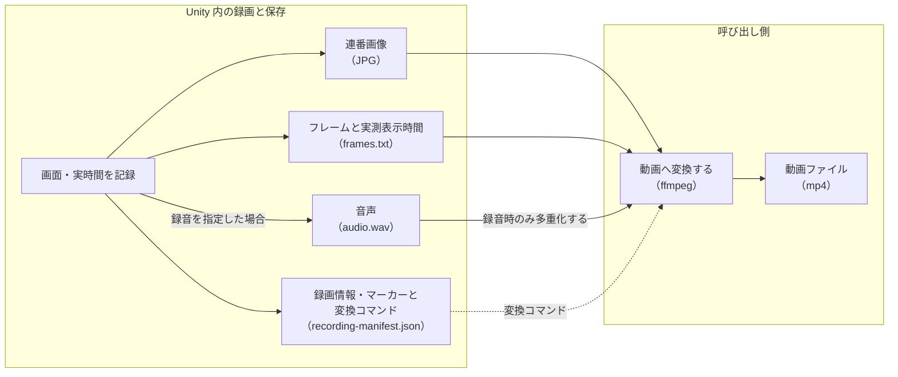

# 録画と成果物

テストや探索を実行した後の出力結果を確認したいときや、生成された成果物を継続的インテグレーション環境などに連携したい際に読むページである。
出力先フォルダの構造やファイル名の命名規則、録画や入力可視化の設定、例外発生時の自動保存、各種計測レポートの出力仕様を解説している。
実行成果物を適切に収集・分析し、不具合の調査や自動パイプラインへの組み込みを行えるようになる。

## 成果物の置き場（`DebugOutput/`）

`DebugOutputPath.DirectoryPath` は Editor では `<Unity プロジェクト>/DebugOutput`、
実機 Development Build では `<Application.persistentDataPath>/DebugOutput`。
以下のパスはすべてこのディレクトリからの相対表記。明示的な出力先指定は既存の各機能の規則に従う。

| パス | 中身 |
|---|---|
| `agent-mailbox/` | メールボックス。`.enabled`（自動起動マーカー）、`req-*.json`、`res-*.json`（1 時間で掃除） |
| `agent/<session>/` | エージェントセッション。`session.json`（結果・手数）、`actions.jsonl`（1 手ごとの観測キー・行動・差分）、`scenario.json`（`agent.export`）、`abnormal-*.png`（stuck・例外時の自動撮影）、`forensics/` |
| `captures/` | `capture` / `agent.observe {"capture":…}` の PNG |
| `scenario-results/<name>-<日時>[-<識別子>]/` | シナリオ結果（`verdict` / `failedSteps` / ステップごとの `waited`）。既存のメニュー／`scenario.run` は `<name>.json`、自律実行は `result.json` |
| `ui-scenario/` | シナリオの撮影・スナップショット・監査 JSON の既定出力先 |
| `scenario-autorun.json` | 自律実行の外部設定。`path` / `name` / `delaySeconds` |
| `scenario-autorun.done.json` | 自律実行の完了通知。結果 JSON の絶対 `path` と同じ `verdict` |
| `snapshots/` | `snapshot {"save":true}` の JSON |
| `recordings/<name>/` | 連番 JPG、`frames.txt`、`audio.wav`、`recording-manifest.json` |
| `forensics/<日時>/` | 例外発生時のスクショ＋UI スナップショット＋ログ |
| `run-archive/` | RunArchive（成果物の索引。スマホ閲覧用ギャラリー） |

`DebugOutput/` は `.gitignore` に入れる。

自律実行はメールボックスの `.enabled` を必要としない。
設定アセット・Android への配置・`adb pull` の手順は [実機での使い方](getting-started.md#5-実機-development-build-で自律実行する) を参照。
シナリオの結果 JSON の形式は Editor と実機で共通。

## 録画

録画は連番 JPG（品質 90）で出し、mp4 への変換は呼び出し側が ffmpeg で行う（ゲームコードにプロセス起動を持ち込まないため）。



Unity が保存した画像・時間情報・任意の音声を、呼び出し側が manifest の変換コマンドで動画にする流れを示します。

```json
{ "submit": "RoomCard0", "recordStart": true, "recordFps": 60, "recordAudio": true },
{ "settleFrames": 600, "recordStop": "battle_first_fight" }
```

- `recordFps` 省略時 30。60fps でフレーム落ちなしを実測済み
- `recordAudio` 既定 false。指定すると `audio.wav` を出し、manifest の `ffmpegCommand` が多重化まで行う。**シーンに `AudioListener` が要る**（無いと正しい長さの無音 WAV ができる）
- **動画の尺は録画した実時間と一致する**（誤差 1 ミリ秒台）。`Time.captureFramerate` は使わず `Application.targetFrameRate` で描画レートを絞り、フレームごとの実時刻を `frames.txt` に持つ
- `markers` が動画の時刻とシナリオのステップを対応付ける（「何秒で壊れたか」→「どのステップか」）
- `droppedFrameCount` がエンコードで捨てたフレーム数

### 入力可視化オーバーレイ

シナリオの `inputOverlay: true` で、録画にパッド／キーボード／ポインタの図と押下ハイライト、直近の入力履歴、ステップラベルを写す。オーバーレイは UI スナップショットと視覚回帰の対象から除外される（`HasOverlayMarkerAncestor`）。

### 注意

- エディタが非フォーカスだと Game View が再描画されず同じ絵が録れる。利用側で `Application.runInBackground` を有効にする
- 録画中は描画レートを目標 fps に絞るため、動きが普段より遅く見えることがある。1 回 30 秒以内が目安
- 中間 JPEG は mp4 の十数倍のディスクを食う。mp4 化したら消す（利用側のツールで自動化するのが安全）
- OS のネイティブ録画（macOS `screencapture -v`）の方が Unity に負荷をかけない。演出の動画確認はそちらを優先し、Unity 録画は入力オーバーレイや markers が要るときに使う

## 例外フォレンジック

`ExceptionForensics` が `Application.logMessageReceived` の Exception を拾い、その瞬間の Game View と UI スナップショットとログを `forensics/` に保存する。`ai_forensics_latest` で最新の要約（先頭 20 行）を取れる。`expect` の `noException` はこの件数が増えていないことを見る。

## 監査・視覚回帰・性能

- レイアウト監査（`UiLayoutAuditor`）: 画面外へのはみ出し、要素の重なりを JSON で返す。`audit: true` のステップと Editor メニュー
- 視覚回帰（`VisualRegression`）: 基準ディレクトリと撮影を比較し、差分領域を出す。無視領域は `ignore.json` で指定。Editor メニューで受け入れ
- 性能計測（`PerformanceRecorder`）: フレーム時間の p95 と GC 割り当てを結果に同梱。`expect` の `frameMsP95Below` / `gcAllocBelow`
- モンキーテスト（`MonkeyTester`）: シード固定でランダム操作。例外が出たらフォレンジックが残る。`ai_monkey --seed 1 --maxSteps 300`
