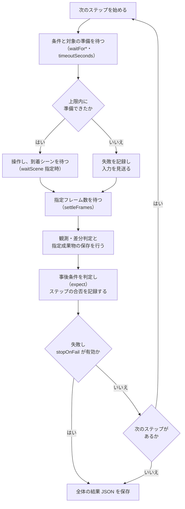

# シナリオガイド

同じ一連の操作手順を定義し、回帰テストとして繰り返し自動実行したくなった際に読むページである。
操作、待機、画面保存、事後条件の判定といったシナリオの記述規則や、対象要素の指定方法、探索結果の書き出し方を解説している。
典型的な失敗例や注意点を把握しながら、再現性の高いテストシナリオを自身で作成できるようになる。

`UiScenarioRunner` は JSON に書いた手順を **条件待ちで** 実行する。「対象が存在し・遮られておらず・操作可能になった瞬間」に送出し、フレーム数で待たない。だから録画に写る時間はゲーム本来の応答時間そのものになる。

## 最小の例

```json
{
  "outputDirectory": "Screenshots/tour",
  "steps": [
    { "waitScene": "Title", "settleFrames": 60 },
    { "submit": "NewGameButton", "settleFrames": 120 },
    { "submit": "MessageButton1", "waitScene": "Home", "settleFrames": 150 },
    { "submit": "TabButton1", "capture": "05_rune_tab", "audit": true },
    { "submit": "RuneListRow0", "expect": [ { "kind": "textVisible", "value": "ルーン詳細" } ] }
  ]
}
```

実行: `scenario.run {"path":"docs/scenarios/tour.json"}`（メールボックス／CLI）か、Editor メニュー `UniTestify/Run UI Scenario...`。結果は `DebugOutput/scenario-results/<name>-<日時>/result.json`（`verdict` / `failedSteps` / `warningCount` / ステップごとの `waited` 秒）。

## ステップの語彙

操作（`ops-reference.md` の行動と同じ）: `submit` `press` `hold` `move` `stick` `key` `text` `click` `tap` `pointerMove` `scroll` `drag` `swipe` `pinch` `scrollTo`。

待ち・確認:

| キー | 意味 |
|---|---|
| `waitScene` | 操作した**結果**として到着するシーン名を待つ |
| `waitForText` / `waitForObject` / `waitForFocus` / `waitForScene` | 操作前のアンカー。条件が**成立するまで待つ**。対象の通常の準備待ちはランナーが自動で行うため省略できる |
| `timeoutSeconds` | 準備待ち・操作後のシーン待ちの実時間上限。既定 30 秒。旧 JSON の省略・0 以下も既定値を使う |
| `settleFrames` | 操作後に待つフレーム数。撮影・監査のあるステップだけ既定 30、それ以外は 0。**フレーム数であり秒ではない**（60fps 固定で回すと 180 = 3 秒） |
| `expect` | 事後条件の配列。未達は `failedSteps` に数え、`stopOnFail` なら打ち切る |
| `comment` | 人向けメモ。AI セッションから書き出したときは「元の実行では未達」が入る |

成果物:

| キー | 意味 |
|---|---|
| `capture` | Game View を `<outputDirectory>/<name>.png` に撮る |
| `snapshot` | UI スナップショット JSON を保存 |
| `audit` | レイアウト監査（はみ出し・重なり）を `<name>-audit.json` に |
| `recordStart` / `recordFps` / `recordAudio` / `recordStop` | 録画の開始・停止（`recording-and-artifacts.md`） |
| `monkey` | そのステップでモンキーテストを回す（`{"seed":1,"maxSteps":200,"maxSeconds":30}`） |

シナリオ全体:

| キー | 意味 |
|---|---|
| `name` / `outputDirectory` | 名前と撮影先 |
| `stopOnFail` | 失敗した時点で止める |
| `inputOverlay` | 録画に入力可視化オーバーレイを写す |
| `recordPerformance` | 性能計測（フレーム時間・GC）を結果に同梱 |
| `visualRegression` | 基準ディレクトリを指定すると撮影を比較 |
| `recordInputs` / `replay` | 入力記録と決定的リプレイ |

## 対象の指定

- 名前: `"NewGameButton"`（階層のどこにあっても最初に見つかったもの）
- パス断片: `"ButtonRow/MessageButton1"`
- ラベル部分一致: `"label:剛 攻撃のルーン"`（同名の行 `ListRowButton(Clone)` を選ぶとき）

## 押せるまで待つ、の中身



通常の操作ステップについて、準備待ち・操作・記録の順序と、準備待ち失敗時の経路および継続条件を示します。

`submit` / `click` / `tap` に対象を指定すれば、ランナーが操作対象の準備を**自動で待ち**、準備後に送出する。
シナリオの前後で `snapshot` や `agent.find` を繰り返し、対象の存在を確認するポーリングは書かない。

1. 対象が存在する
2. 前面の Graphic に遮られていない（モーダルの暗幕・別パネル越しには押さない）
3. `Selectable.IsInteractable()` が true

上限は `timeoutSeconds`（既定 30 秒）。超えたら警告を出して見送る（`verdict=fail`）。結果の `waited` が「押せるまで待った実時間」＝応答時間の計測値になる。

`click` / `tap` はターゲット名を受け、**RectTransform の中心**へ入力を送る。
`OnPointerClick` だけで反応するカード・独自 UI は `submit` ではなく `click` / `tap` を使う。
次の例では、各対象が出現し、遮蔽がなくなり、操作可能になるまで自動で待つ。

```json
{
  "steps": [
    { "click": "InventoryPanel/ItemCard0" },
    { "tap": "ItemDetailPanel/CloseArea" }
  ]
}
```

操作対象とは別の到達条件が必要な場合は、`waitForObject` 等のアンカーを一度指定する。
アンカーはその場の存在確認だけを返すものではなく、**成立までランナー内で待ち続ける**（準備待ちの既定上限 30 秒）。
`waitForObject` は存在・遮蔽・操作可否、`waitForText` は文字の可視性、`waitForFocus` はフォーカス、
`waitForScene` はシーンのロードを待つ。複数を指定した場合はすべての成立を待つ。
単独の待機ステップにも使えるため、存在確認の外部ループや固定時間の sleep を足さない。

```json
{
  "steps": [
    { "waitForObject": "ItemDetailPanel/CloseArea" },
    { "waitForText": "詳細", "press": "east" }
  ]
}
```

「画面が出るまで待つ」は `waitForObject`、「出ていることを断定する」は `objectExists` を使う。
`objectExists` / `objectAbsent` はアクティブな GameObject だけを `FindTarget` と同じ対象指定で一回評価する。
UI スナップショットに含まれない画面ルートや非 UI オブジェクトにも使える。
遷移前の `objectExists` はその場で未達となり、遷移完了を待たない。

```json
{
  "steps": [
    { "waitForObject": "InventoryPanel", "timeoutSeconds": 30 },
    { "expect": [{ "kind": "objectExists", "target": "InventoryPanel" }] }
  ]
}
```

## AI セッションから回帰シナリオを作る

Codex / Claude が `agent.act` で辿った手順は、`agent.export {"name":"tour"}` でそのまま `scenario.json` になる。

- `agent.act` に付けた `expect` はステップの `expect` に写る（**探索しながら事後条件を残す**）
- `waitFor*` と `timeoutSeconds` も同名フィールドに写る。行動を伴わない待機も一ステップとして保存する
- 未達だった手は `comment: "元の実行では未達"` 付きで残る（再現用）
- 書き出し先は `DebugOutput/agent/<session>/scenario.json`。回帰に採用するなら利用側の `docs/debug-scenarios/` へコピーして PR

## 罠

- 遷移直後はフェードで画面が暗い。撮影は `settleFrames` を十分に（150 目安）取るか、`waitScene` の後に置く
- モーダルを開いたまま次の画面を撮らない（`blocked:` で押せない）
- `settleFrames` は fps に依存する。ランナーは開始時に `targetFrameRate=60` を固定する運用にすると実時間と一致する
- 「撮れた」と「正しく撮れた」は違う。枚数や尺ではなく画像を見る。監査 0 件も目視の代わりにはならない
